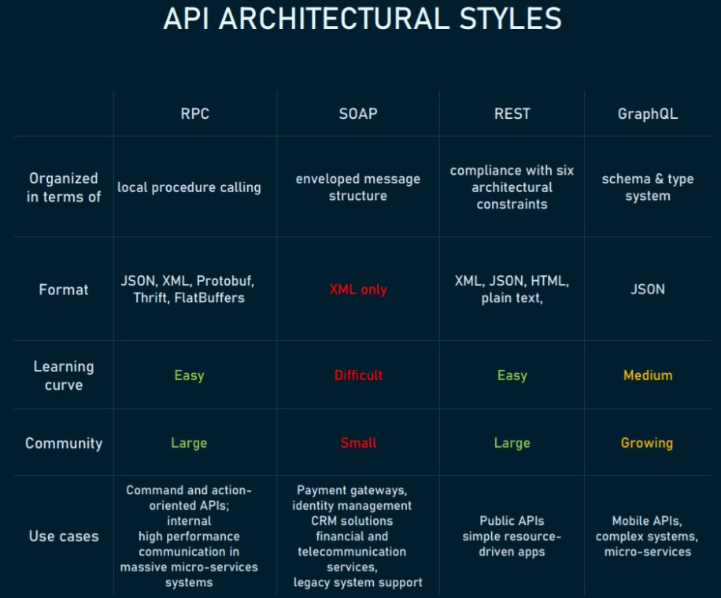
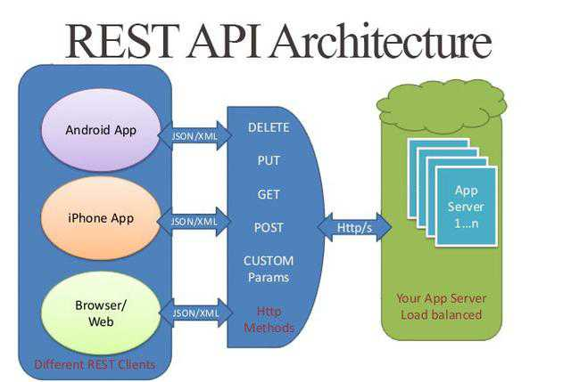
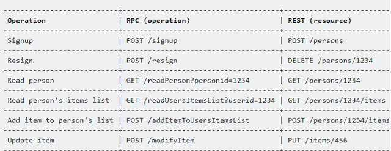
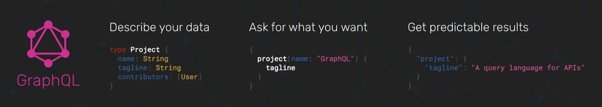

# API Mode

## **Request/Response API**
## **1. Representational State Transfer (REST)**: making data available as resources

## Pros

## **Decoupled client and server**
## Decoupling the client and the server as much as possible, REST allows for a better abstraction than RPC. A system with abstraction levels is able to encapsulate its details to better identify and sustain its properties. This makes a REST API flexible enough to evolve over time while remaining a stable system.

 

## **Discoverability**
## Communication between the client and server describes everything so that no external documentation is required to understand how to interact with the REST API.

 

## **Cache-friendly**
## Reusing a lot of HTTP tools, REST is the only style that allows caching data on the HTTP level. In contrast, caching implementation on any other API will require configuring an additional cache module.

 

## **Multiple formats support**
## The ability to support multiple formats for storing and exchanging data is one of the reasons REST is currently a prevailing choice for building public APIs.

 

## Cons

## **No single REST structure**
## There’s no exact right way to build a REST API. How to model resources and which resources to model will depend on each scenario. This makes REST simple in theory, but difficult in practice.

 

## **Big payloads**
## REST returns a lot of rich metadata so that the client can understand everything necessary about the state of the application just from its responses. And this chattiness is no big deal for a big network pipe with lots of bandwidth capacity. But that’s not always the case. This was the key driving factor for Facebook coming up with the description of GraphQL style in 2012.

 

## **Over- and under-fetching problems**
## Containing either too much data or not enough of it, REST responses often create the need for another request.

 

## `Use Case`
## **Management APIs**
## APIs focused on managing objects in a system and intended for many consumers are the most common API type. REST helps such APIs to have strong discoverability, good documentation, and it fits this object model well.

 

## **Simple resource-driven apps**
## REST is a valuable approach for connecting resource-driven apps that don’t need flexibility in queries.

 

---

## **2. Remote Procedure Call (RPC)**: invoking a function on another system

## Pros

## **Straightforward and simple interaction**
## RPC uses GET to fetch information and POST for everything else. The mechanics of the interaction between a server and a client come down to calling an endpoint and getting a response.

 

## **Easy-to-add functions** 
## If we get a new requirement for our API, we can easily add another endpoint executing this requirement: 1) Write a new function and throw it behind an endpoint and 2) now a client can hit this endpoint and get the info meeting the set requirement.

 

## **High performance**
## Lightweight payloads go easy on the network providing high performance, which is important for shared servers and for parallel computations executing on networks of workstations. RPC is able to optimize the network layer and make it very efficient with sending tons of messages per day between different services.

 

## Cons

## **Tight coupling to the underlying system**
## An API’s abstraction level contributes to its reusability. The tighter it is to the underlying system, the less reusable it will be for other systems. RPC’s tight coupling to the underlying system doesn’t allow for an abstraction layer between the functions in the system and the external API. This raises security issues as it’s quite easy to leak implementation details about the underlying system into the API. An RPC’s tight coupling makes scalability requirements and loosely coupled teams hard to achieve. So, the client either worries about any possible side effects of calling a particular endpoint or tries figuring out what endpoint to call because it doesn’t understand how the server is naming its functions.

 

## **Low discoverability** 
## In RPC there’s no way to introspect the API or send a request and start understanding what function to call based on its requests.

 

## **Function explosion**
## It’s so easy to create new functions. So, instead of editing the existing ones, we create new ones ending up with a huge list of overlapping functions that are hard to understand.

 

## `Use Case`
## **Command API**
## An RPC is the proper choice for sending commands to a remote system. For instance, a Slack API is very command-focused: Join a channel, leave a channel, send a message. So, the designers of the Slack API modeled it in an RPC-like style making it small, tight, and easy to use.

 

## **Customer-specific APIs for internal microservices** 
## Having direct integration between a single provider and consumer, we don’t want to spend a lot of time transmitting a lot of metadata over the wire, like a REST API does. With high message rate and message performance, gRPC and Twirp are strong cases for microservices. Using HTTP 2 under the hood, gRPC is able to optimize the network layer and make it very efficient with sending tons of messages per day between different services. However, if you’re not aiming at high network performance, but rather at a stable API contact between teams publishing highly distinctive microservices, REST will ensure that.

---

## **3. GraphQL**

## Pros

## **Typed schema**
## GraphQL publishes in advance what it can do, which improves its discoverability. By pointing a client at the GraphQL API, we can find out what queries are available.

 

## **Fits graph-like data very well**
## Data that goes far into linked relations but not good for flat data.

 

## **No versioning**
## The best practice with versioning is not to version the API at all.

## While REST offers multiple API versions, GraphQL uses a single, evolving version that gives continuous access to new features and contributes to cleaner, more maintainable server code.

 

## **Detailed error messages**
## In a similar fashion to SOAP, GraphQL provides details to errors that occurred. Its error message includes all the resolvers and refers to the exact query part at fault.

 

## **Flexible permissions**
## GraphQL allows for selectively exposing certain functions while preserving private information. Meanwhile, REST architecture doesn’t reveal data in portions. It’s either all or nothing.

 

## Cons

## **Performance issues**
## GraphQL trades off complexity for its power. Having too many nested fields in one request can lead to system overload. So, REST remains a better option for complex queries.

 

## **Caching complexity**
## As GraphQL isn’t reusing HTTP caching semantics, it requires a custom caching effort.

 

## **A lot of pre-development education.**
## Not having enough time to figure out GraphQL niche operations and SDL, many projects decide to follow the well-known path of REST.

 

## `Use Case`
## **Mobile API**
## In this case, network performance and single message payload optimization is important. So, GraphQL offers a more efficient data loading for mobile devices.

 

## **Complex systems and microservices**
## GraphQL is able to hide the complexity of multiple systems integration behind its API. Aggregating data from multiple places, it merges them into one global schema. This is particularly relevant for legacy infrastructures or third-party APIs that have expanded over time.

 

---

## **Event-driven API**
## **5. WebHook**
## **6. WebSocket**
## **7. HTTP Streaming**

---
---

# Reference

- ## [Swagger: API Documentation & Design Tools for Teams](https://swagger.io)
- ## [REST與RPC區別](https://ppfocus.com/0/didae1574.html)
- ## [Twirp: a sweet new RPC framework for Go](https://blog.twitch.tv/en/2018/01/16/twirp-a-sweet-new-rpc-framework-for-go-5f2febbf35f)
