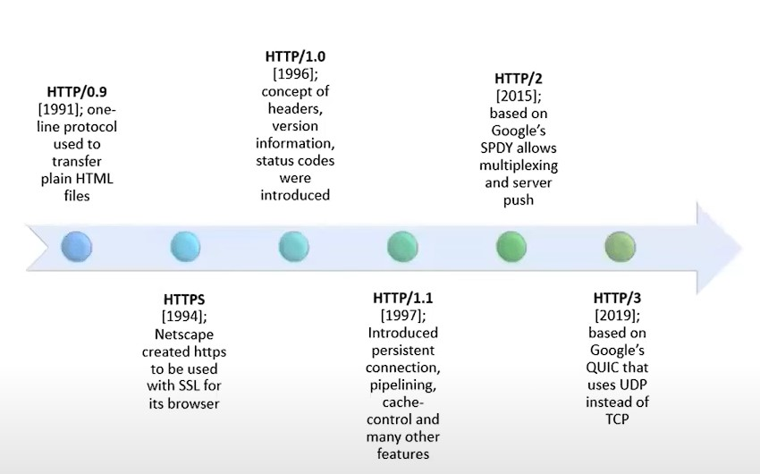
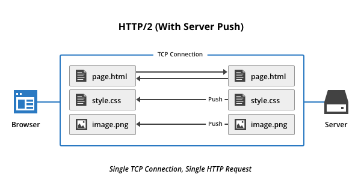
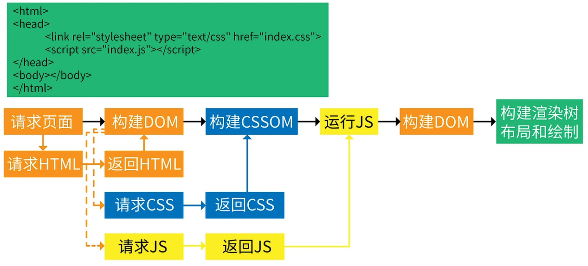
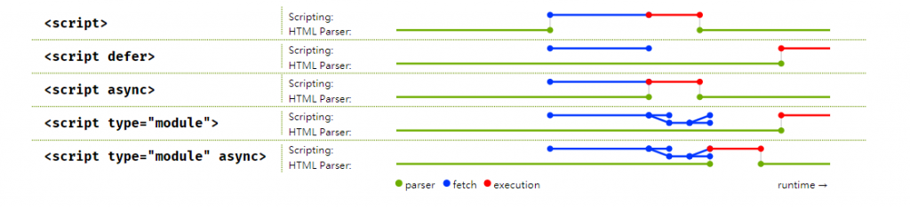

# What You Should Know About HTTP 

---

# HTTP/1.1

## **Cache Control**
## Read next section for more detail

 

## **Persistent Connection**

 

## **Request Pipelining**

---

# HTTP/2

## **Multiplexing**
## Multiplexing will allow multiple requests and response messages to retrieve resources in a single TCP connection simultaneously.

 

## **Header Compression**
## Each request via HTTP contains header information. With HTTP/1.1, many headers are repeated in one session and duplicate the same info. This overhead is considerable, HTTP/2 removes the excess header while pressing the remaining headers and forcing all HTTP headers to be sent in a compressed format.

 

## **Server Push**
## With HTTP/1.1 it must wait for the client to send the connection. Server Push allows the server to avoid delays in sending data by “pushing” responses that it claims the client needs to cache it and automatically this will speed up page load time by reducing the number of requests.

 

## **Binary Format**
## HTTP/1.1 sends data in the textual format, while HTTP/2 sends data in binary format. Binary protocols are more efficient to parse and reduce the number of errors, compared to previous versions of textual protocols.

---

# 瀏覽器緩存機制
## **1. HTTP 緩存**

## **使用Last-Modified 存在的弊端：**
- ## 我們編輯了文件，但文件的內容沒有改變。服務端並不清楚我們是否真正改變了文件，它仍然通過最後編輯時間進行判斷。因此這個資源在再次被請求時，會被當做新資源，進而引發一次完整的響應——不該重新請求的時候，也會重新請求。

- ## 當我們修改文件的速度過快時（比如花了100ms 完成了改動），由於If-Modified-Since 只能檢查到以秒為最小計量單位的時間差，所以它是感知不到這個改動的——該重新請求的時候，反而沒有重新請求了。

 

## **2. 內存緩存**
## MemoryCache，是指存在內存中的緩存。從優先級上來說，它是瀏覽器最先嘗試去命中的一種緩存。從效率上來說，它是響應速度最快的一種緩存。

## 內存緩存是快的，也是“短命”的。它和渲染進程“生死相依”，當進程結束後，也就是tab 關閉以後，內存裡的數據也將不復存在。

 

## **3. 服務工作者緩存**
## 必須以https 協議為前提。
## Service Worker 是一種獨立於主線程之外的Javascript 線程。它脫離於瀏覽器窗體，因此無法直接訪問DOM。這樣獨立的個性使得Service Worker 的“個人行為”無法干擾頁面的性能，這個“幕後工作者”可以幫我們實現離線緩存、消息推送和網絡代理等功能。我們藉助Service worker 實現的離線緩存就稱為Service Worker Cache。

## Service Worker 的生命週期包括install、active、working 三個階段。一旦Service Worker 被install，它將始終存在，只會在active 與working 之間切換，除非我們主動終止它。這是它可以用來實現離線存儲的重要先決條件。

 

## **4. 推送緩存(HTTP/2 開始有的新特性)**
## Push Cache 是指HTTP/2 在server push 階段存在的緩存
- ## Push Cache 是緩存的最後一道防線。瀏覽器只有在Memory Cache、HTTP Cache 和Service Worker Cache 均未命中的情況下才會去詢問Push Cache。
- ## Push Cache 是一種存在於會話階段的緩存，當session 終止時，緩存也隨之釋放。
- ## 不同的頁面只要共享了同一個HTTP/2 連接，那麼它們就可以共享同一個Push Cache。

---

# 瀏覽器頁面渲染過程

---

# DNS域名解析過程

---

# Reference
- ## [瀏覽器渲染頁面的流程](https://www.bilibili.com/video/BV18f4y1H7Zu?spm_id_from=333.999.0.0)
- ## [DNS域名解析過程](https://www.bilibili.com/video/BV1uL4y1B7aE?spm_id_from=333.999.0.0)
- ## [HTTP Header: Cache-Control](https://developer.mozilla.org/zh-TW/docs/Web/HTTP/Headers/Cache-Control)
- ## [Root Zone Management](https://www.iana.org/domains/root/servers)
- ## [VPN概念、技術原理及誤區](https://www.bilibili.com/video/BV1KY411t75D?spm_id_from=333.999.0.0)
- ## [HTTP隊頭阻塞是什麼](https://itw01.com/I97CEU2.html)
- ## [TCP隊頭阻塞與HTTP隊頭阻塞](https://linkexin.github.io/notes/TCP-%E9%98%9F%E5%A4%B4%E6%8B%A5%E5%A1%9E-%E5%92%8C-HTTP-%E9%98%9F%E5%A4%B4%E6%8B%A5%E5%A1%9E-%E5%92%8C-QUIC)