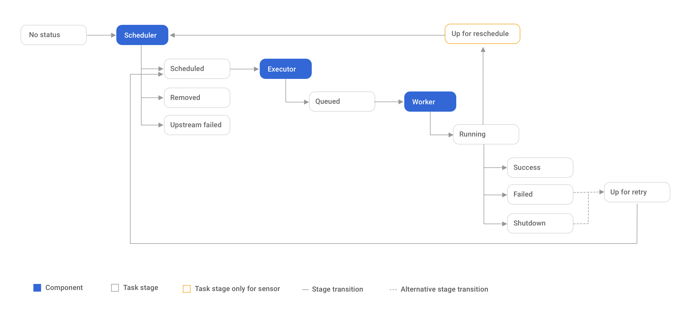

# Workflow Management System



---

# Cheat Sheet
```
#測試
airflow test <dag> <task> 2021-08-01

# 手動觸發 DAG
airflow unpause <dag>
airflow trigger_dag <dag>
```
---
# Deploy with Docker Compose
```sh
curl -LfO "https://airflow.apache.org/docs/apache-airflow/2.1.2/docker-compose.yaml"
mkdir ./dags ./logs ./plugins
echo -e "AIRFLOW_UID=$(id -u)\nAIRFLOW_GID=0" > .env
docker-compose up airflow-init
docker-compose up
```

---
# Helm Chart for Apache Airflow

```sh
# Create namespace airflow
kubectl create namespace airflow

# Add the official repository of the airflow helm chart
helm repo add apache-airflow https://airflow.apache.org

# Update the repo
helm repo update

# Install the airflow helm chart
helm install airflow apache-airflow/airflow --namespace airflow

# Check release
helm ls -n airflow

# Port forward 8080:8080
kubectl port-forward svc/airflow-webserver 8080:8080 -n airflow

# Get the chart values
helm show values apache-airflow/airflow > values.yaml

# Upgrade the chart
helm upgrade --install airflow apache-airflow/airflow --namespace airflow -f values.yaml

# Delete the Helm release
helm delete airflow --namespace airflow
```

---

# Key Note
>> ### 一個 DAG Run 中的執行日期，只等於它「負責」的日期，不等於它實際被 Airflow 排程器執行的日期。一個被自動排程且執行日期為 dt 的 DAG Run，實際上是在 dt + schedule_period 後被 Airflow 執行。

---

# Cron Time String Format

```
┌───────────── Minute (0 - 59)
│ ┌─────────── Hour (0 - 23)
│ │ ┌───────── Day of the month (1 - 31)
│ │ │ ┌─────── Month  (1 - 12)
│ │ │ │ ┌───── Day of the week  (0 - 7)
│ │ │ │ │
* * * * * 
```

|Cron time string|Description|
|----------------|-----------|
|30 * * * *	|Execute a command at 30 minutes past the hour, every hour.|
|0 13,15 * * 1	|Execute a command at 1:00 p.m. and 3:00 p.m. UTC every Monday.|
|*/5 * * * *|	Execute a command every five minutes.|
|0 */2 * * *|	Execute a command every second hour, on the hour.|

---

# Reference
- https://artifacthub.io/packages/helm/airflow-helm/airflow
- https://airflow.apache.org/docs/apache-airflow/stable/start/docker.html?highlight=docker%20compose
- https://www.astronomer.io/events/recaps/official-airflow-helm-chart
- https://airflow.apache.org/docs/helm-chart/stable/manage-dags-files.html
