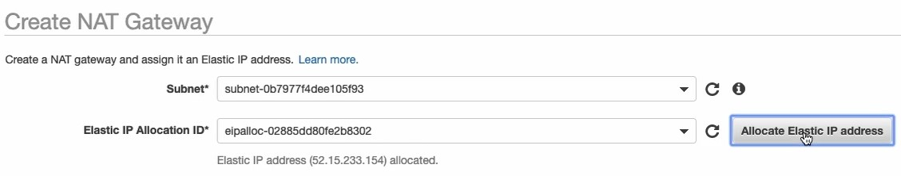
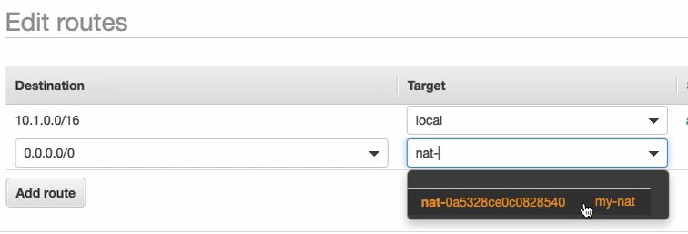
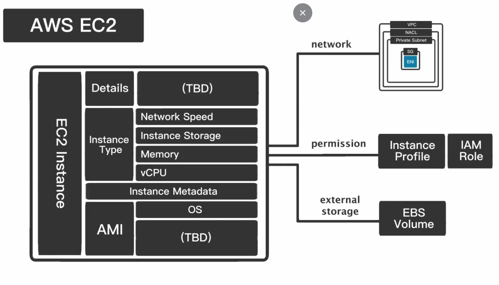
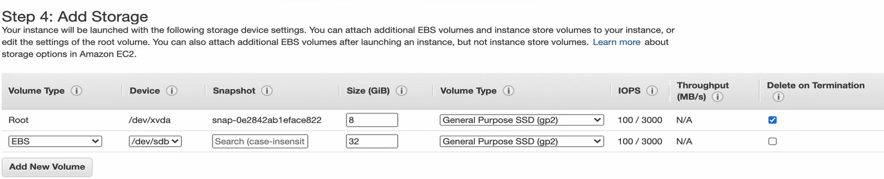
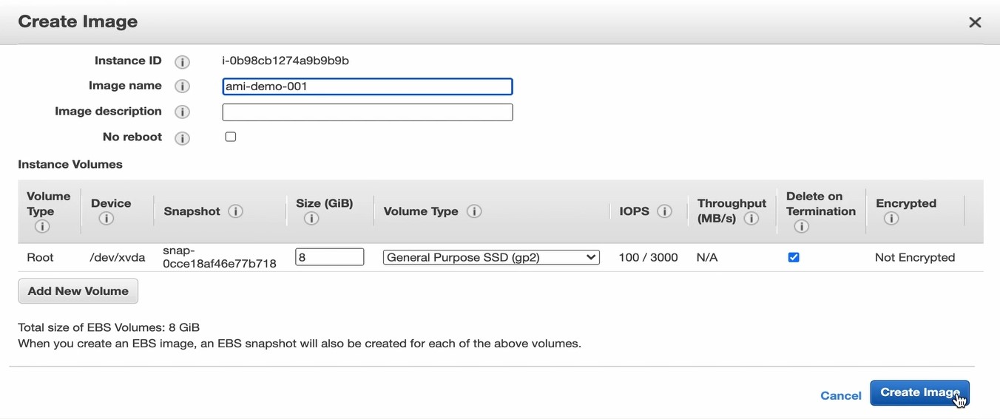
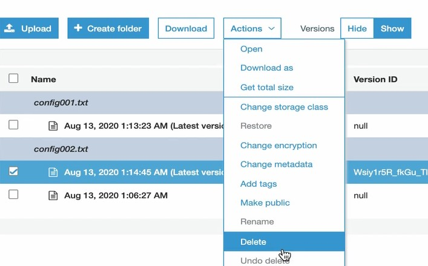
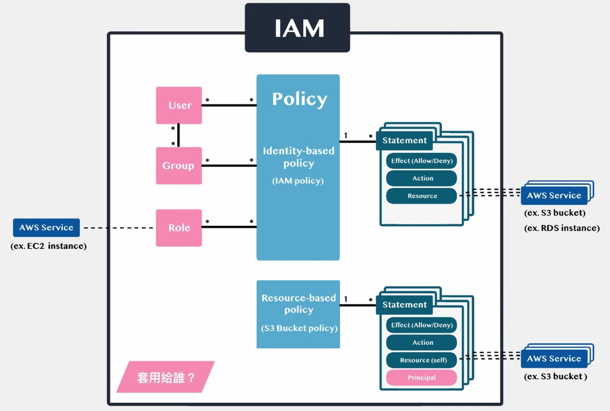

<br/>

# AWS Virtual Private Cloud (VPC) 網路架構


<br/>

## **VPC外網 - Public Subnet to the Internet (IGW)**


## **VPC內網 - Private Subnet to Private Subnet**


```sh
ssh-add -k vpc-ec2.pem
ssh-add -L
ssh -A ec2-user@3.21.106.235
```

## **VPC內網 - Private Subnet to the Internet (NAT)**





## **VPC安全 - NACL & SG 網路安全配置**


## **VPC資源清理**


---

# AWS Elastic Compute Cloud (EC2) 運算資源


## **EC2儲存資源 - Instance Storage vs Elastic Block Storage (EBS)**


## **EC2儲存資源 - EBS Types 方案比較**


## **EC2儲存資源 - EBS Volume 建立與使用**


<br/>


<br/>

**尚未格式化**


<br/>


<br/>

**已格式化**


<br/>


<br/>


<br/>

**產假資料**


## **EC2儲存資源 - EBS Snapshot 備份建立與使用**


## **EC2模板 - AMI 架構介紹**


## **EC2模板 - EBS-backed AMI 建立與使用**




---

# AWS Simple Storage Service (S3) 儲存資源

## **S3 vs EBS 方案比較**


## **S3 架構與版本控管**




## **S3 儲存類別與生命週期管理**


---

# AWS Relational Database Service (RDS) 資料庫儲存資源

## **RDS vs EC2(+db) 方案比較**


## **RDS架構**


## **建立雲端資料庫**


## **資料庫備份**


## **備援機制**


## **流量分擔機制**


---

# Identity and Access Management (IAM) 架構
