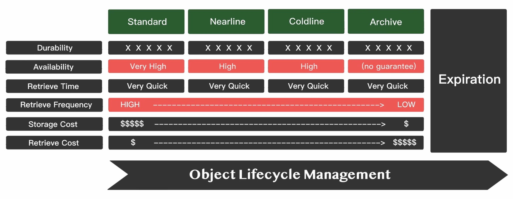
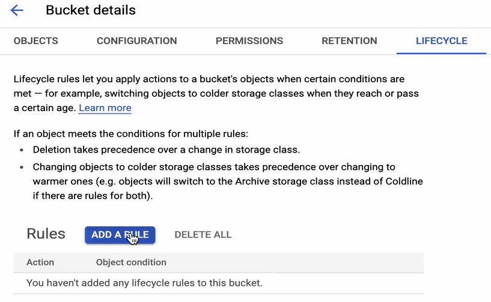

 

# GCP Virtual Private Cloud (VPC) 網路架構

## **VPC外網 - Public VM to the Internet (Default Internet Gateway)**

### 允許ssh

## **VPC內網 - VM to VM**

### 允許ping

## **VPC內網 - Private VM to the Internet (NAT)**
### NAT 必須與 Subnet 的 Region 相同

## **VPC安全 - Routes & Firewall Rules - Network Tags**

---

# GCP Compute Engine (CE) 運算資源

## **CE儲存資源 - Local SSD vs Persistent Disk**

## **CE儲存資源 - Persistent Disk 方案比較**

## **CE儲存資源 - Persistent Disk 建立與使用**

### **`後續同AWS EBS`**

## **CE儲存資源 - Persistent Disk 備份建立與使用**

## **CE模板 - Machine Image 架構介紹**

## **CE模板 - Machine Image 建立與使用**

---

# GCP Cloud Storage 儲存資源

## **Cloud Storage vs Persistent Disk 方案比較**

## **Cloud Storage 架構與版本控管**

## **Cloud Storage 儲存類別與生命週期管理**

---

# GCP Cloud SQL & Cloud Spanner 資料庫儲存資源

## **Cloud SQL vs VM(+db) 方案比較**

## **Cloud SQL 架構**

## **建立雲端資料庫**

## **資料庫備份**

 

 

 

## **備援機制**

## **流量分擔機制**

## **Cloud Spanner 架構**

 

 

---

# Identity and Access Management (IAM) 架構
