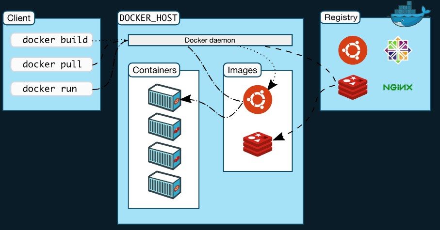

---

# Overview



---

# What's Different from VM?

## 1. Instead of virtualizing hardware, containers only virtualize operating system

## 2. All apps or containers are run by a single kernel, that makes almost everything faster and more efficient

---

# Container Registry

## Self-Hosted
- ## Docker Registry 2.0
- ## Harbor

## Cloud Provider
- ## Google Container Registry (GCR)


---

# Deploy a Registry Server

```sh
# Run a local registry
docker run -d -p 5000:5000 --restart=always --name registry -v /home/evan/mnt/registry:/var/lib/registry  registry:2
```

```sh
# The first part of the tag is a hostname and port, Docker interprets this as the location of a registry, when pushing.
docker tag express-server localhost:5000/express-server
```

```sh
# Push the image to the local registry running at localhost:5000
docker push localhost:5000/express-server
```

```sh
# List images in the local registry
curl -X GET http://localhost:5000/v2/_catalog
```

# Test an Insecure Registry

- ## Edit the **daemon.json** file, whose default location is **/etc/docker/daemon.json** on Linux

```json
{
  "insecure-registries": ["myregistrydomain.com:5000"]
}
```

---

# Push and Deploy a Docker Image on Heroku

```sh
heroku login
heroku container:login
docker build  -t registry.heroku.com/<your-app>/web .
docker push registry.heroku.com/<your-app>/web
# Deploy
heroku container:release web -a <your-app>
```

---

# Minify Docker Image

```sh
docker-slim build <image_name>
```

---

# Best Practices
## 1. Use official and verified Docker Images as Base Image
## 2. Use Specific Docker Image Versions
## 3. Use Small-Sized Official Images
## 4. Optimize Caching Image Layers
> ## Order Dockerfile commands from least to most frequently changing 
## 5. Use .dockerignore file
## 6. Make use of Multi-Stage Builds
## 7. Use the Least Privileged User 
## 8. Scan your Images for Security Vulnerabilities
```sh
docker scan <image_name>
```

---

# Reference
- ## [Reduce the size of container images with DockerSlim](https://developers.redhat.com/articles/2022/01/17/reduce-size-container-images-dockerslim)
