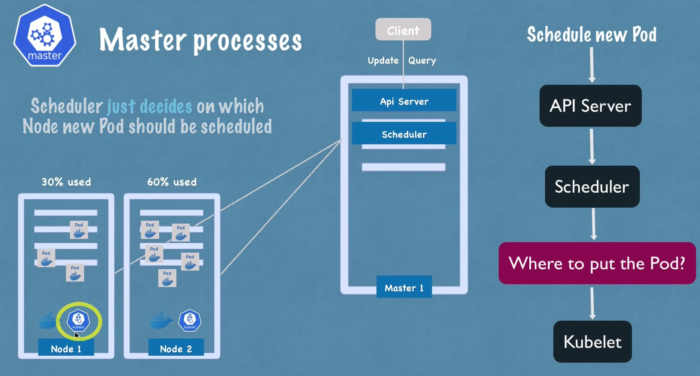

# What is **`Kubernetes`**?

# A popular **container orchestration tool**

---

# Components

## Node (Worker Node)

- ## A physical or virtual machine


## Pod

- ## Smallest unit of K8s
- ## Abstraction over the container
- ## Usually 1 application per **Pod**
- ## Each Pod gets its own IP address
- ## New IP address on re-creation


## Service

- ## Permanant IP address
- ## Acts as a load balancer
- ## Lifecycle of services and pods are not connected
- ## Internal service for the database
- ## External service for the application


## Ingress

- ## Routes the traffic into the cluster
  - ### The request goes first to **ingress** and it does forwarding then to **service**

## ConfigMap

- ## External configuration of the application
- ## Used as environment variables

## Secret

- ## Stores the secret data (base64 encoded)
- ## Used as environment variables

## Volumes

- ## K8s doesn't manage data persistance
- ## Attaches a physical storage on a hard drive to the pod
  - ### Storage on the local machine
  - ### Or remote, outside of the K8s cluster

## Deployment

- ## For stateless applications
- ## Determines the number of replicas of pods
- ## DB can't be replicated via **deployment** because DB has state

## Stateful Set

- ## Not easy
- ## For stateful applications or database
- ## Manages which pods are currently writing to the storage and which pods are reading from the storage in order to avoid data inconsistencies
  

---

# Worker Node

- ## Each node has multiple pods on it
- ## 3 processes must be installed on every node
  ## 1. Container runtime
  ## 2. Kubelet
  ## 3. Kube proxy
  ##
- ## **Kubelet**
  - ## Interacts with both the container and node
  - ## Starts the pod with a container inside
  - ## Assigns resource from the node to the container like cpu, ram, etc.
- ## **Kube proxy**
  - ## Responsible for forwarding requests from services to pods

# Master Node

- ## 4 processes run on every node
  ## 1. Api server
  ## 2. Scheduler
  ## 3. Controller manager
  ## 4. etcd
- ## **Api server**
  - ## Interact with Api server with some clients
    ## 1. K8s dashboard (UI)
    ## 2. Kubelet, Kubectl (CLI)
    ## 3. K8s Api
  - ## Cluster gateway
  - ## Acts as a gatekeeper for authentication
    
- ## **Scheduler**
  - ## Decides on which specific worker node the next pod or component will be scheduled
    
- ## **Controller manager**
  - ## Detects cluster state changes
    
- ## **etcd**
  - ## Cluster brain!
    - ## What resources are available?
    - ## Does the cluster state change?
    - ## Is the cluster healthy?
  - ## Cluster changes get stored in the key-value store


---

# Port, TargetPort, and NodePort in K8s

- ## nodePort
  > ### This setting makes the service visible outside the Kubernetes cluster by the node’s IP address and the port number declared in this property. The service also has to be of type NodePort (if this field isn’t specified, Kubernetes will allocate a node port automatically)
- ## port
  > ### Expose the service on the specified port internally within the cluster. That is, the service becomes visible on this port, and will send requests made to this port to the pods selected by the service
- ## targetPort
  > ### This is the port on the pod that the request gets sent to. Your application needs to be listening for network requests on this port for the service to work


---

# Service Type

- ## ClusterIP Service (Internal Service)
  
  
- ## Headless Service

  

- ## NodePort Service

  - ## Not secure

  

- ## LoadBalancer Service
  

---

# Ingress


---

# Namespaces

## Use cases

## 1. Structure components

## 2. Conflicts: Many teams, same application

## 3. Resource sharing: Staging and Development

## 4. Resource sharing: Blue/Green Deployment


## 5. Access and resource limits on namespaces


---

# Helm: Package Manager for K8s

```sh
# Install helm
curl -fsSL -o get_helm.sh https://raw.githubusercontent.com/helm/helm/master/scripts/get-helm-3
chmod 700 get_helm.sh
./get_helm.sh
```

## 3 features

## 1. Helm charts

- ## Bundle of YAML files

## 2. Template engine

## 3. Release management

```sh
# List chart repositories
helm repo ls
# Read through all of the repositories configured on the system
helm search repo
# Add a chart repository
helm repo add <CHART_REPO_NAME> <CHART_REPO_URL>
helm repo update
# Install a chart
helm install <NAME> <CHART_NAME> --values=my-values.yaml
# Show the chart's values
helm show values <CHART_NAME>
```

---

# Kustomize: Kubernetes Native Configuration Management

```sh
curl -s "https://raw.githubusercontent.com/kubernetes-sigs/kustomize/master/hack/install_kustomize.sh"  | bash
```

---

# Kind:  a Tool for Running Local K8s Clusters Using Docker Container “Nodes”

```sh
curl -Lo ./kind https://kind.sigs.k8s.io/dl/v0.11.1/kind-linux-amd64
chmod +x ./kind
./kind create cluster --name my-cluster --config kind-cluster.yaml

# Check the cluster info
kubectl cluster-info

# Check the nodes with kubectl
kubectl get nodes -o wide
```

---

# K8s Operator

- ## Manage stateful applications
- ## Custom control loop
  
- ## Make use of **CRDs** (**Custom Resource Definitions**)

<br />


---

# Other Convenient Tool

## 1. [Forge](https://forge.sh/docs/tutorials/quickstart)
## 2. [Kustomize](https://kustomize.io/)

---

# Cloud Service for K8s

## 1. Google Kubernetes Engine (GKE, provided by GCP)
## 2. Elastic Kubernetes Service (EKS, provided by AWS)

---

# Reference

- ## [使用 Kustomize 訂製 Helm Charts](https://www.qikqiak.com/post/use-kustomize-custom-helm-charts/)
