# What is DevOps ?

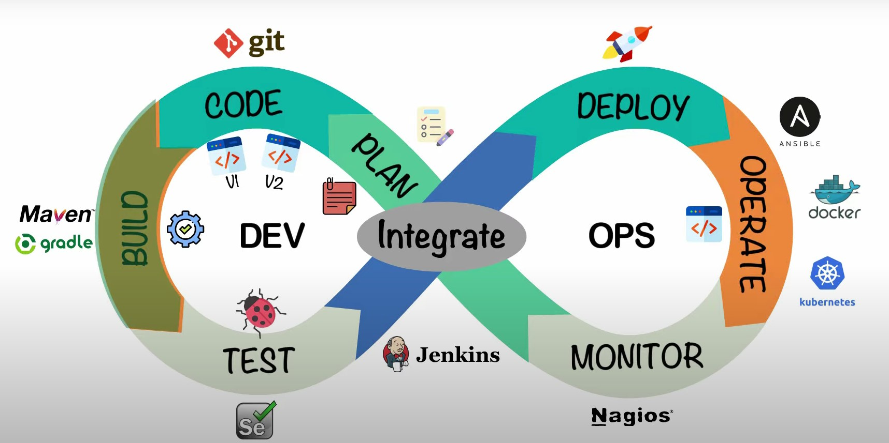

---

# What is CI/CD ?

## Continuous Integration (CI)

- ## Developers push many small changes to a central git repository per day
- ## These changes are verified by an automatic software that runs comprehensive tests to ensure no major issues are seen by customers

## Top 3 Benefits of CI

- ## CI is the first step to to Devops automation and helps with code collaboration
- ## CI helps improve developer speed without breaking existing code
- ## CI helps reduce customer churn and user satisfaction by preventing broken code from publishing

## Continuous Deployment (CD)

- ## Push the code out to the customers

---

# Infrastructure as Code Tools

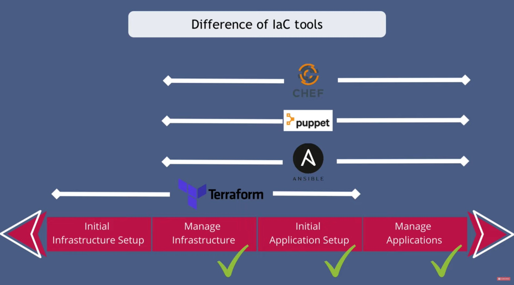
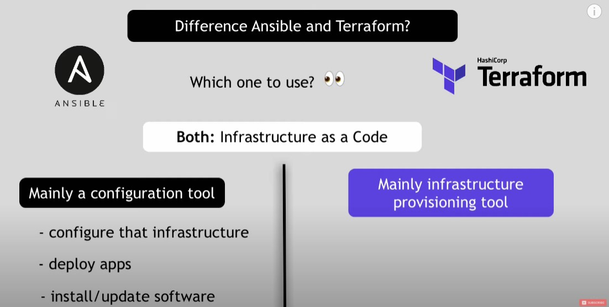

---

# Deployment Strategies

## 重建部署

優點：

-   便於設定
-   應用狀態完整更新

缺點：

-   對使用者影響很大，預期的宕機時間取決於下線時間和應用啟動耗時

 

## 滾動部署

### 滾動部署策略是指通過逐個替換應用的所有例項，來緩慢釋出應用的一個新版本。通常過程如下： 

 

### 在負載排程後有個版本A的應用例項池， 一個版本B的例項部署成功，可以響應請求時，該例項被加入到池中。然後版本A的一個例項從池中刪除並下線。考慮到滾動部署依賴於系統，可以調整如下引數來增加部署時間：

-  並行數，最大批量執行數：同時釋出例項的數目
-  最大峰值：考慮到當前例項數，例項可以加入的數目
-  最大不可用數：在滾動更新過程中不可用的例項數

優點：

-   便於設定
-   版本在例項間緩慢釋出
-   對於能夠處理資料重平衡的有狀態應用非常方便

缺點：

-   釋出/回滾耗時
-   支援多個API很困難
-   無法控制流量

 

## 藍綠部署

### 藍綠部署策略與滾動部署不同，版本B（綠）同等數量的被並排部署在版本A（藍）旁邊。當新版本滿足上線條件的測試後，流量在負載均衡層從版本A切換到版本B。  

優點：

-   實時釋出、回滾
-   避免版本衝突問題，整個應用狀態統一一次切換

缺點：

-   比較昂貴因為需要雙倍的資源
-   在釋放版本到生產環境之前，整個平臺的主流程測試必須執行
-   處理有狀態的應用很棘手

 

## 金絲雀部署

### 金絲雀部署是指逐漸將生產環境流量從版本A切換到版本B。通常流量是按比例分配的。例如90%的請求流向版本A，10%的流向版本B。這個技術大多數用於缺少足夠測試，或者缺少可靠測試，或者對新版本的穩定性缺乏信心的情況下。

優點：

-   版本面向一部分使用者釋出
-   方便錯誤評估和效能監控
-   快速回滾

缺點：

-   釋出緩慢

 

## A/B測試

### A/B測試是指在特定條件下將一部分使用者路由到新功能上。它通常用於根據統計來制定商業決策，而不是部署策略。然而，他們是相關的，可以在金絲雀部署方式上新增額外功能來實現，所以我們這裏簡要介紹一下。這個技術廣泛用於測試特定功能的切換，併發布使用佔大部分的版本。下面是可以用於在版本間分散流量的條件：

-   瀏覽器cookie
-   查詢引數
-   地理位置
-   技術支援：瀏覽器版本、螢幕尺寸、作業系統等
-   語言  

優點：

-   多個版本並行執行
-   完全控制流量分佈

缺點：

-   需要智慧負載均衡
-   對於給定的會話，很難定位問題，分散式跟蹤是必須的

## 影子部署

### 影子部署是指在版本A旁邊釋出版本B，將版本A進來的請求同時分發到版本B，同時對生產環境流量無影響。這是測試新特徵在產品負載上表現的很好用的方式。當滿足上線要求後，則觸發釋出新應用。這個技術配置非常複雜，而且需要特殊條件，尤其是分出請求。例如一個購物車平臺，如果你想影子測試支付服務，你可能最終會是使用者為他們的訂單支付兩次。 這種情況下，可以通過建立一個模擬的服務來重複響應使用者的請求。  

優點：

-   可以使用生產環境流量進行效能測試
-   對使用者無影響
-   直到應用的穩定性和效能滿足要求後才釋出

缺點：

-   雙倍資源，成本昂貴
-   不是真實使用者測試，可能出現誤導
-   配置複雜
-   某種情況下需要模擬服務

 

|策略 |服務不斷線 |真實環境測試 |目標客戶分群 |預算成本 |退版時間 |使用者影響 |複雜度|  
|--|--|--|--|--|--|--|--| 
|重建部署 | ✖ | ✖ | ✖ | ★☆☆ |★★★ |★★★ |☆☆☆ |  
|滾動部署 | ✔ | ✖ | ✖ | ★☆☆ |★★★ |★☆☆ |★☆☆ |  
|藍綠部署 | ✔ | ✖ | ✖ | ★★★ |☆☆☆ |★★☆ |★★☆ |  
|金絲雀部署 | ✔ | ✔ | ✖ | ★☆☆ |★☆☆ |★☆☆ |★★☆ |  
|A/B部署 | ✔ | ✔ | ✔ | ★☆☆ |★☆☆ |★☆☆ |★★★ |  
|影子部署 | ✔ | ✔ | ✖ | ★★★ |☆☆☆ |☆☆☆ |★★★ |

---

# GitOps 與 Kubernetes 的整合
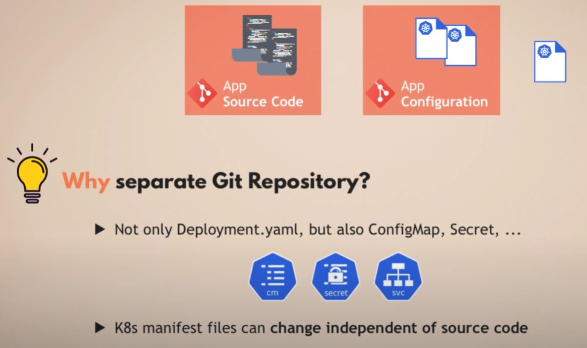
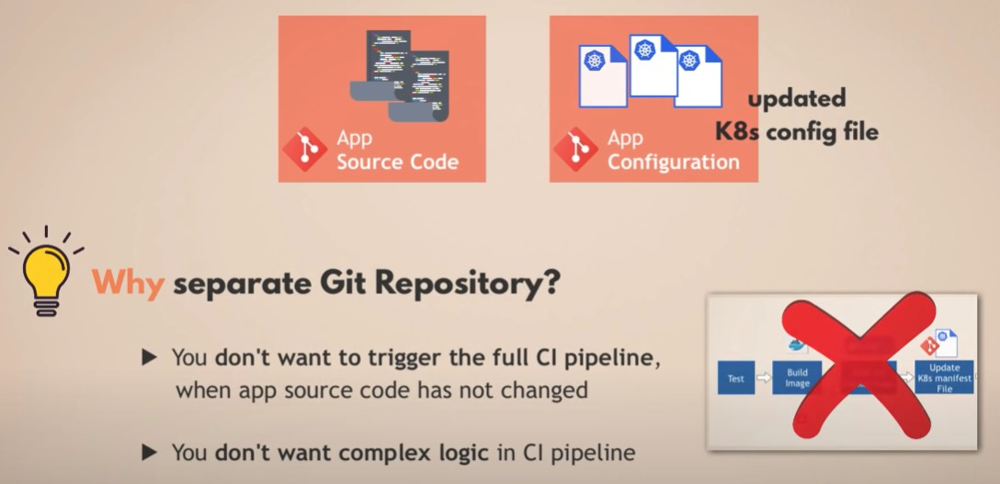

## 架構一
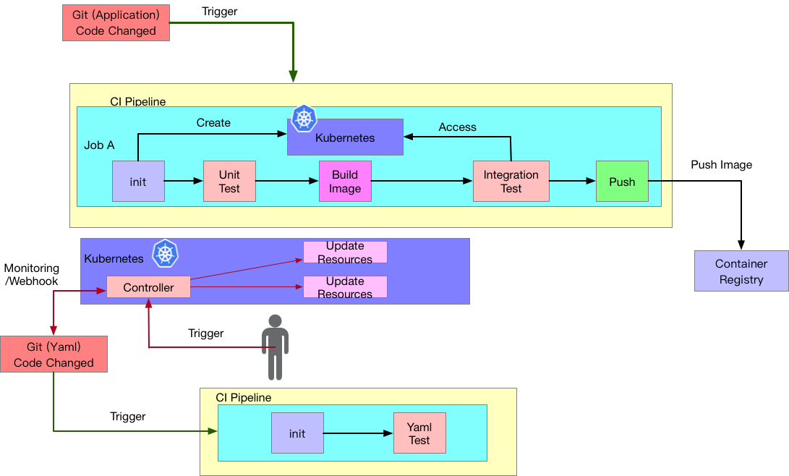
### 1. 開發者對 Git(Application) Repo 產生修改，這份修改觸發了相關的 CI Pipeline ，這過程中經歷過測試等階段，最後將相關的 Image 給推到遠方的 Container Registry。

### 2. 系統管理者針對 Git(Yaml) Repo 產生修改，這份修改觸發了相關的 CI Pipeline, 這過程中會針對 Yaml 本身的格式與內容進行測試，確保沒有任何出錯。

### 3. 當 Git(Yaml) Repo 通過 CI Pipeline 而合併程式碼後，接下來 Kubernetes 內的 Controller 會知道 Git(Yaml) Repo 有更新
- ### 一種是 Git 那邊透過 Webhook 的方式告訴 Controller
- ### 一種是 Controller 定期輪詢後得到這個結果

### 4. 同步 Git(Yaml) Repo 裡面的狀態描述檔案與 Kubernetes 叢集內的狀態，確保目前運行狀態與 Git 內的檔案描述一致

### 5. 如果今天不想要3這個步驟的自動化，也可以由管理員經過確認後，手動要求 Controller 去同步 Git 並更新

 

## 架構二
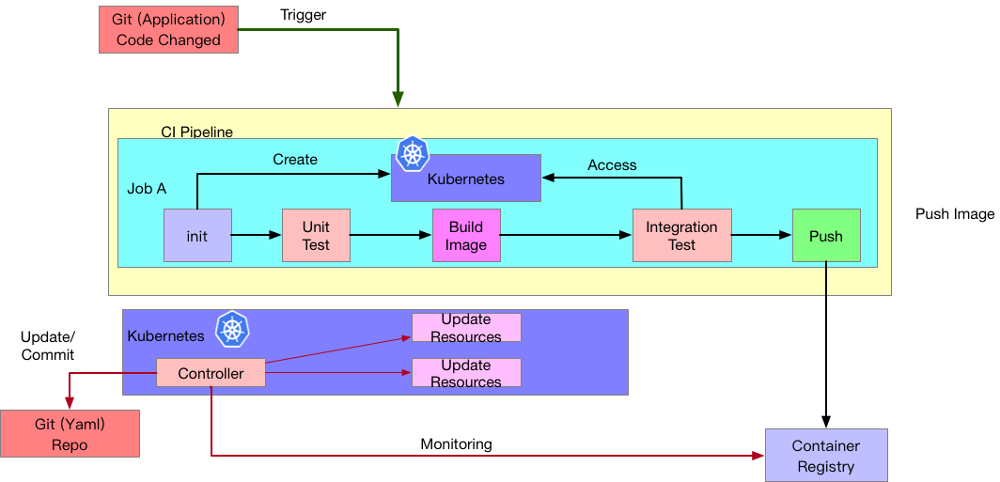
### 這種架構希望可以解決 Contaienr Image 頻繁更新的問題，因此 Controller 本身又會多了監聽 Container Registry 的能力。

 

### 當 Controller 發現有新的版本的時候，只要這個版本號碼有符合規則，就會把新的版本資訊給套用到 Kubernetes 裡面。

 

### 但是因為 GitOps 的原則是希望以 Git 作為單一檔案來源，如果這樣做就會破壞這個規則，因此這時候 Controller 就要根據當前 Image Tag 的變化，把變化內容給寫回到 Git(Yaml) Repo 之中。

 

### 這也是為什麼 Controller 要對 Git(Yaml) Repo 進行更新與撰寫新 Commit 的原因。

 

### 也因為這個原因，我們的 Controller 也必須要對該 Git(Yaml) Repo 擁有讀寫的能力，這方面對於系統又會增加一些設定要處理

 

## Microsoft Azure - GitOps based CI/CD Pipeline

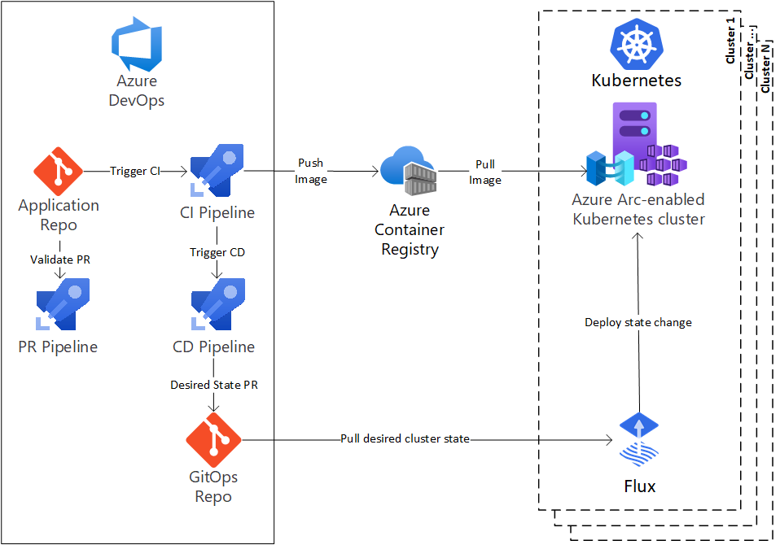

---

# Intro to Argo CD

## CD Workflow without Argo CD
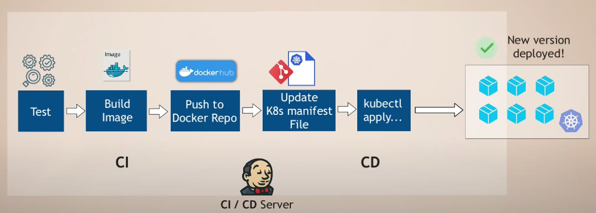
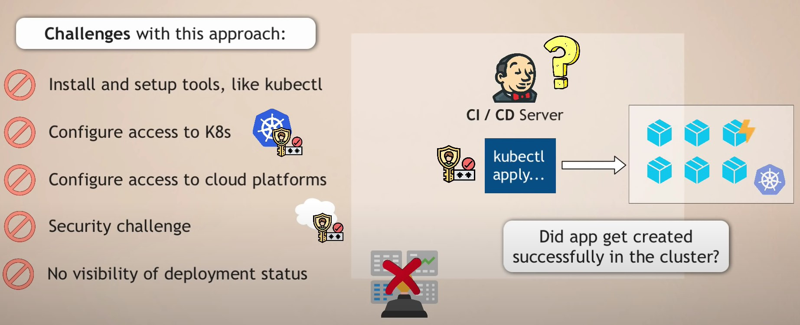

## CD Workflow with Argo CD 
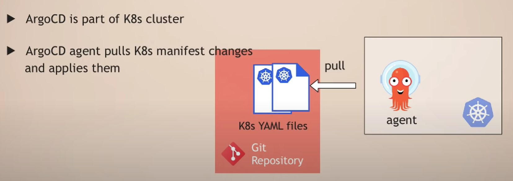
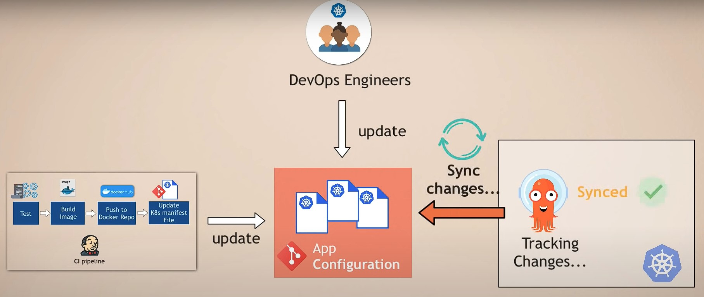
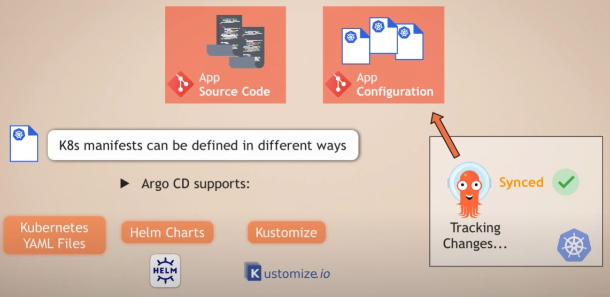
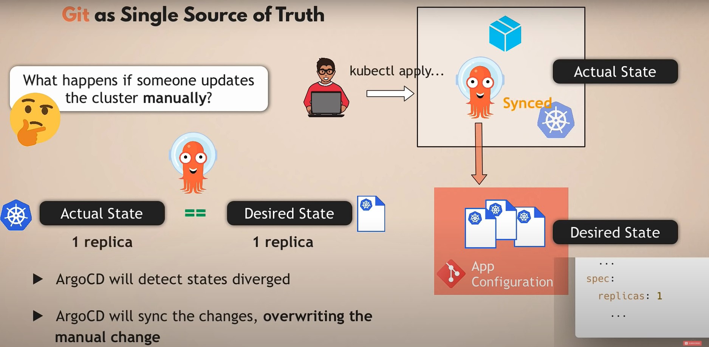
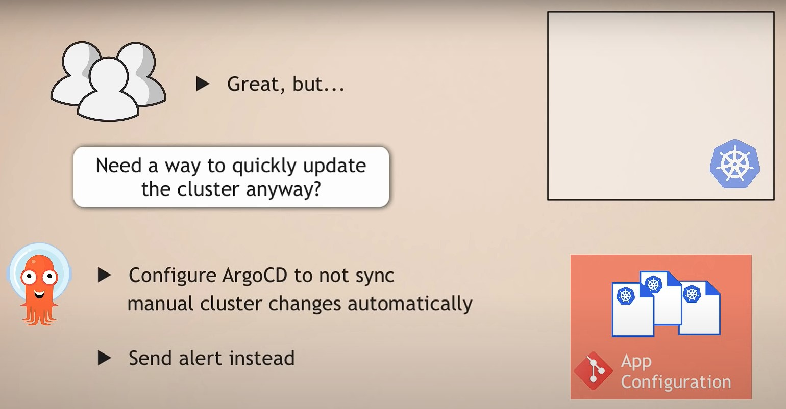

## Working with multiple clusters
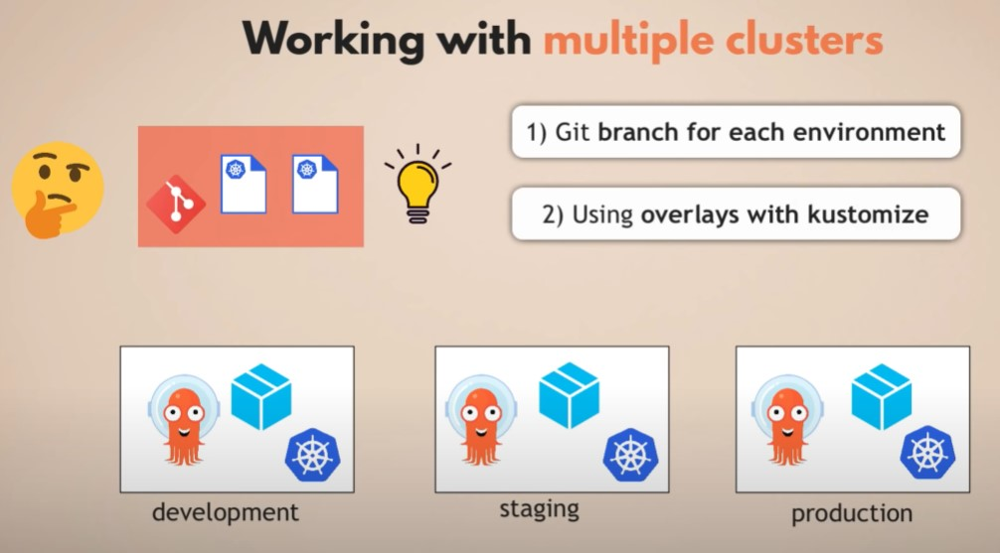
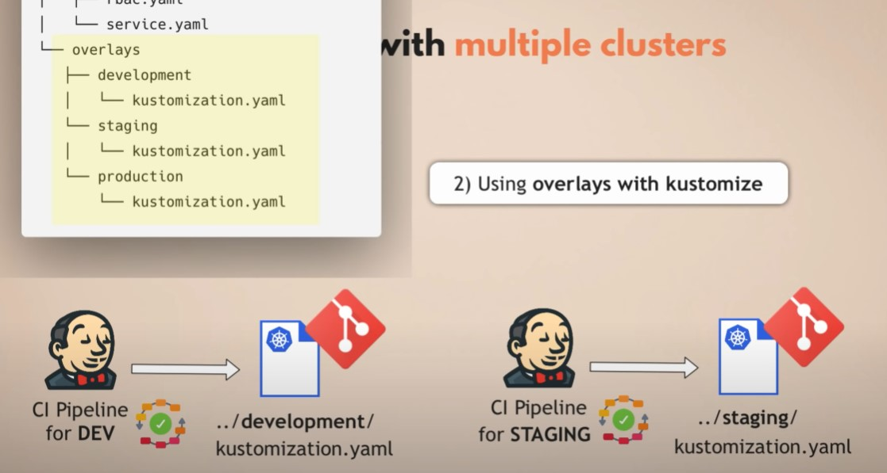

---

# Reference
## [Gitlab CI 串接 Google Container Registry (GCR)](https://www.gaia.net/tc/news_detail/2/123)
## [Argo CD - Declarative GitOps CD for Kubernetes](https://argo-cd.readthedocs.io/en/stable/)
## [Flux - the GitOps family of projects](https://fluxcd.io/)
