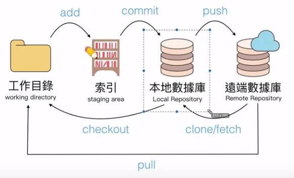
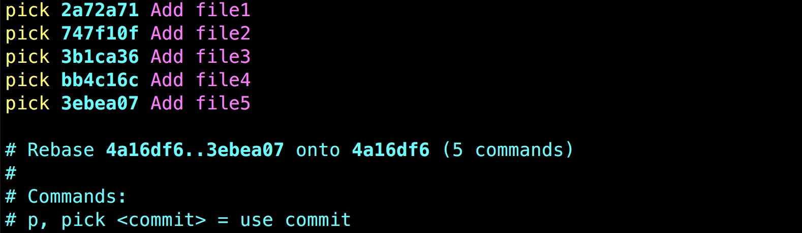
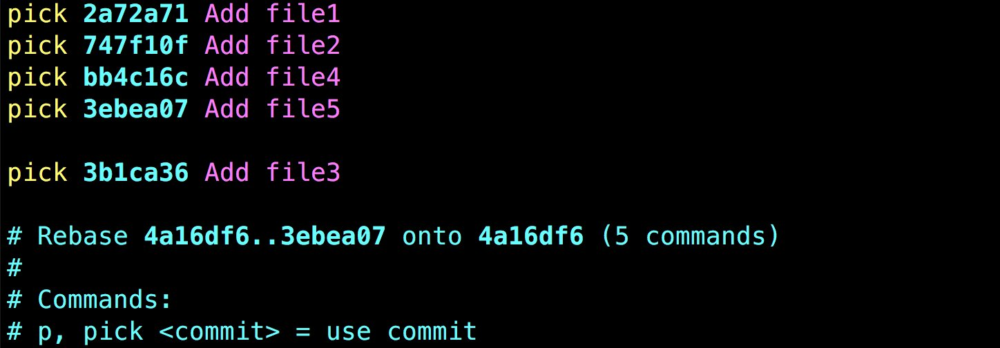
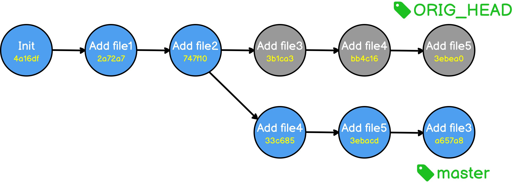
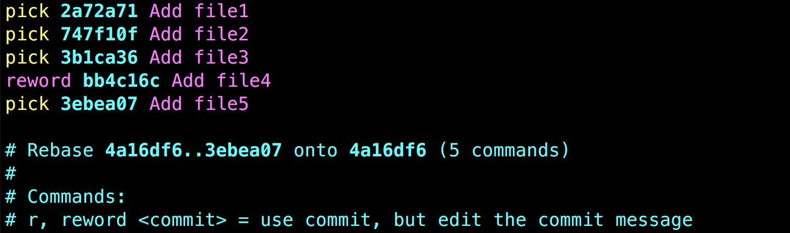
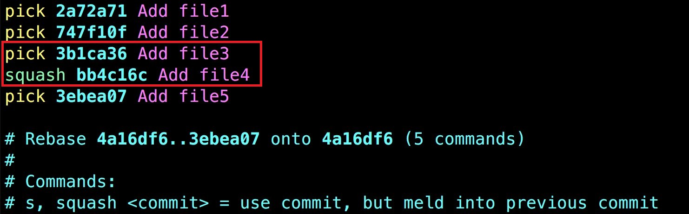
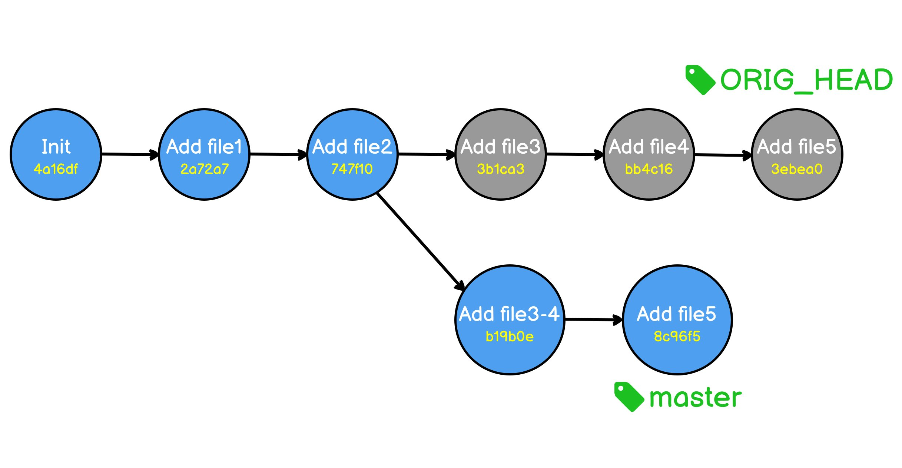

# Overview



# Basic

```sh
git config --list
git status -s
git log --oneline --graph --decorate
git reflog  查看git操作歷史紀錄(使用情境：當不小心使用hard模式reset了某個commit)
git init
git add .
git commit -m "commit msg"
```

---

```sh
git remote	顯示遠端數據庫清單
git remote add <repository_name> <url>	註冊遠端數據庫
git remote rename <old_name> <new_name>	重新命名遠端數據庫名稱
git push <repository_name> <branch_name>
git pull <repository_name> <branch_name>
```

---

```sh
git branch -a	顯示分支列表
git branch <branch_name>	建立分支
git branch -d <branch_name> 刪除分支
git merge <branch_name>	合併分支
git merge <branch_name> --no--ff	合併分支(取消快轉)
git checkout <commit_number>/<branch_name>  切換版本/分支
```

---

```sh
# Alias
git config --global alias.ac "commit -am"
# Change message of last commit
git commit --amend -m "yeah" 
# Undo a commit with a new commit
git revert <commit_id>

```

---

# Advanced

## **1. Change commit order**

```
git rebase -i <commitID>
```



---



---



## **2. Change commit message**



## **3. Merge commit**



---



---

# Q&A

在新的環境(機器)初始化

```sh
git config --global core.editor "code --wait"
git config --global user.name "evan"
git config --global user.email evan@example.com
#Important!
git config --global core.ignorecase false
```

<br/>

後悔 commit 怎麼辦?

```sh
git reset head^
git add .
git commit -m "commit message"
git push origin master --force
```

<br/>

暫存

```sh
git stash
git stash list
git stash apply
```

<br/>

後悔 rebase 怎麼辦?

```sh
git reset --hard ORIG_HEAD
```

<br/>

reset, rebase, revert 差異

|指令 |改變歷史紀錄 |說明 |
|-----|------------|-----|
|Reset |是|把目前的狀態設定成某個指定的 Commit 的狀態，通常適用於尚未推出去的 Commit| 
|Rebase |是| 不管是新增、修改、刪除 Commit 都相當方便，用來整理、編輯還沒有推出去的 Commit 相當方便，但通常也只適用於尚未推出去的 Commit| 
|Revert |否| 新增一個 Commit 來反轉（或說取消）另一個 Commit 的內容，原本的 Commit 依舊還是會保留在歷史紀錄中。雖然會因此而增加 Commit 數，但通常比較適用於已經推出去的 Commit，或是不允許使用 Reset 或 Rebase 之修改歷史紀錄的指令的場合|

---

# Reference
- ## [關於檔名的大小寫](https://gitbook.tw/posts/2018-06-05-case-sensitive)
- ## [善用Commitizen](https://commitizen-tools.github.io/commitizen)
- ## [git錯誤：物件檔案為空（object-file-is-empty）解決方案](https://codertw.com/%E8%BB%9F%E9%AB%94%E9%96%8B%E7%99%BC%E5%B7%A5%E5%85%B7/24929)
