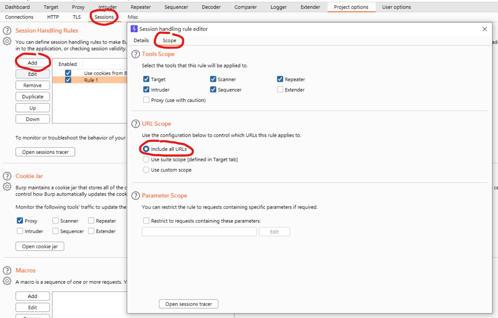
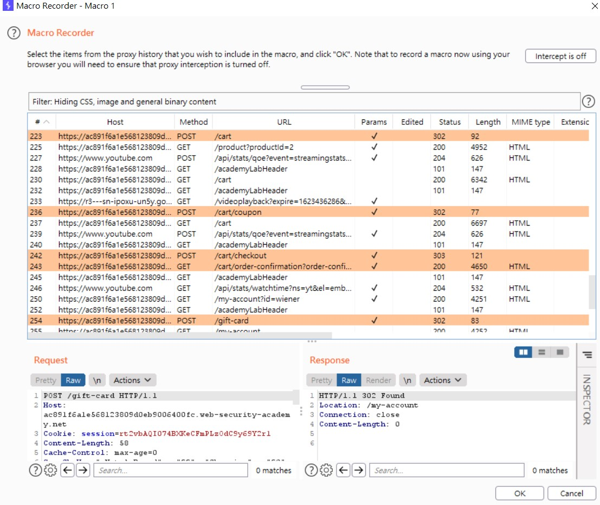
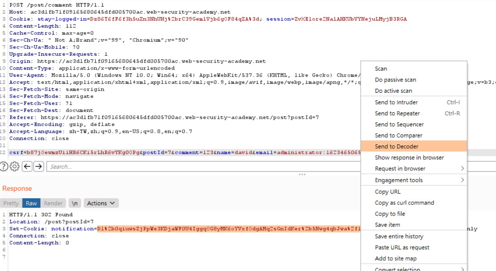

# Convinient Tool: Burp Suite
https://portswigger.net/burp/releases/professional-community-2021-5-2?requestededition=community

---

# Business Logic Vulnerabilities
## 1. Excessive trust in client-side controls

### 1. Excessive trust in client-side controls

### 2. 2FA broken logic

### Brute-force the verification code.

## 2. Failing to handle unconventional input

### 1. High-level logic vulnerability

### Negative count.

### 2. Low-level logic flaw

### Value overflow.

### 3. Inconsistent handling of exceptional input

Email: very-long-string-very-long-string-very-long-string-very-long-string-very-long-string-very-long-string-very-long-string-very-long-string-very-long-string-very-long-string-very-long-string-very-long-string-very-long-string-very-long-string-very-long-string-very-long-string-very-long-string@ac4f1fbb1f47a1ae80d6bbac01fe00d5.web-security-academy.net
Email address is truncated to 255 characters.

Make sure that the very-long-string is the right number of characters so that the "m" at the end of @dontwannacry.com is character 255 exactly.
Email: **very-long-string-very-long-string-very-long-string-very-long-string-very-long-string-very-long-string-very-long-string-very-long-string-very-long-string-very-long-string-very-long-string-very-long-string-very-long-string-very-long-string-@dontwannacry.com**.ac4f1fbb1f47a1ae80d6bbac01fe00d5.web-security-academy.net

## 3. Making flawed assumptions about user behavior

### 1. Inconsistent security controls

### 2. Weak isolation on dual-use endpoint

### 3. Password reset broken logic

### 4. 2FA simple bypass

### 5. Insufficient workflow validation

### 6. Authentication bypass via flawed state machine

## 4. Domain-specific flaws

### 1. Flawed enforcement of business rules

### 2. Infinite money logic flaw

## 5. Providing an encryption oracle

### 1. Authentication bypass via encryption oracle

23 bytes => "Invalid email address: "   
Need to pad the "Invalid email address: " prefix with enough bytes so that the number of bytes you will remove is a multiple of 16.

Add 9 bytes to the start

