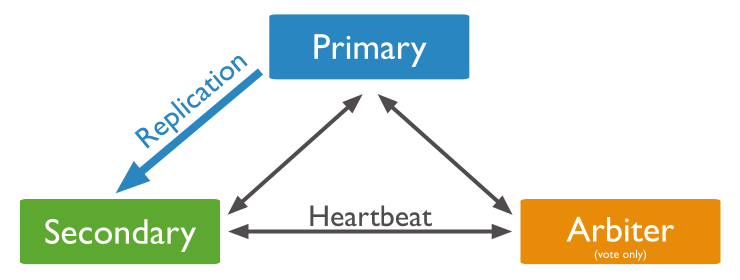

# Databases and Collections

## **Capped Collections**
## Capped collections are fixed-size collections that support high-throughput operations that insert and retrieve documents based on insertion order. Capped collections work in a way similar to circular buffers: once a collection fills its allocated space, it makes room for new documents by overwriting the oldest documents in the collection.

<br />

## **Time Series Collections**
### New in version 5.0.
## Time series collections efficiently store sequences of measurements over a period of time. Time series data is any data that is collected over time and is uniquely identified by one or more unchanging parameters. The unchanging parameters that identify your time series data is generally your data source's metadata.


Example | Measurement | Metadata
--------|-------------|---------
Weather data | Temperature | Sensor identifier, location
Stock data | Stock price | Stock ticker, exchange
Website visitors | View count | URL

---
---

# Indexes

## Index Use
## Indexes can improve the efficiency of read operations.

---

## Index Properties
## 1. **TTL Indexes**
## TTL indexes are special indexes that MongoDB can use to automatically remove documents from a collection after a certain amount of time. This is ideal for certain types of information like **machine generated event data**, **logs**, and **session information** that only need to persist in a database for a finite amount of time.

<br />

## 2. **Unique Indexes**
## The unique property for an index causes MongoDB to reject duplicate values for the indexed field. Other than the unique constraint, unique indexes are functionally interchangeable with other MongoDB indexes.

<br />

## 3. **Partial Indexes**
### New in version 3.2.
## Partial indexes only index the documents in a collection that meet a specified filter expression. By indexing a subset of the documents in a collection, partial indexes have lower storage requirements and reduced performance costs for index creation and maintenance.

## Partial indexes offer a superset of the functionality of sparse indexes and should be preferred over sparse indexes.

<br />

## 4. **Sparse Indexes**
## The sparse property of an index ensures that the index only contain entries for documents that have the indexed field. The index skips documents that do not have the indexed field.

## You can combine the sparse index option with the unique index option to prevent inserting documents that have duplicate values for the indexed field(s) and skip indexing documents that lack the indexed field(s).

<br />

## 5. **Hidden Indexes**
### New in version 4.4.
## Hidden indexes are not visible to the query planner and cannot be used to support a query.

## By hiding an index from the planner, users can evaluate the potential impact of dropping an index without actually dropping the index. If the impact is negative, the user can unhide the index instead of having to recreate a dropped index. And because indexes are fully maintained while hidden, the indexes are immediately available for use once unhidden.

## Except for the _id index, you can hide any indexes.

---

## Covered Queries
## When the query criteria and the projection of a query include **only the indexed fields**, MongoDB returns results directly from the index **without scanning any documents or bringing documents into memory**


--- 

## Index Intersection
## For queries that specify compound query conditions, if one index can fulfill a part of a query condition, and another index can fulfill another part of the query condition, then MongoDB can use the intersection of the two indexes to fulfill the query

<br/>

## **Index Prefix Intersection**
## MongoDB can use an intersection of either the entire index or the index prefix. An index prefix is a subset of a compound index, consisting of one or more keys **starting from the beginning of the index**

## Consider a collection orders with the following indexes:

```
{ qty: 1 }
{ status: 1, ord_date: -1 }
```

## To fulfill the following query which specifies a condition on both the qty field and the status field, MongoDB can use the intersection of the two indexes:

```
db.orders.find( { qty: { $gt: 10 } , status: "A" } )
```

<br/>

## **Index Intersection and Sort**
## Index intersection does not apply when the sort() operation requires an index **completely separate from the query predicate**

## For example, the orders collection has the following indexes:

```
{ qty: 1 }
{ status: 1, ord_date: -1 }
{ status: 1 }
{ ord_date: -1 }
```

## MongoDB cannot use index intersection for the following query with sort:

```
db.orders.find( { qty: { $gt: 10 } } ).sort( { status: 1 } )
```

## However, MongoDB can use index intersection for the following query with sort since the index { status: 1, ord_date: -1 } can fulfill part of the query predicate

```
db.orders.find( { qty: { $gt: 10 } , status: "A" } ).sort( { ord_date: -1 } )
```

---
---
# Storage Engine

## What is a storage engine?

<br />

## A storage engine is the part of a database that is responsible for managing how data is stored, both in memory and on disk. Many databases support multiple storage engines, where different engines perform better for specific workloads. For example, one storage engine might offer better performance for read-heavy workloads, and another might support a higher throughput for write operations.

<br />

## 1. **WiredTiger Storage Engine** (Default)

## 2. **In-Memory Storage Engine**
- ## Available in MongoDB Enterprise. Rather than storing documents on-disk, it retains them in-memory for more predictable data latencies.

## 3. **GridFS**
- ## A versatile storage system that is suited to handling large files, such as those exceeding the 16 MB document size limit.


---
---

# Journaling 

## To provide durability in the event of a failure, MongoDB uses ``write ahead logging`` to on-disk journal files.

<br />

## **journal**
## A sequential, binary transaction log used to bring the database into a valid state in the event of a hard shutdown. Journaling writes data first to the journal and then to the core data files. MongoDB enables journaling by default for 64-bit builds of MongoDB version 2.0 and newer. Journal files are pre-allocated and exist as files in the data directory.

---
---

# Transactions

## For situations that require atomicity of reads and writes to multiple documents (in a single or multiple collections), MongoDB supports multi-document transactions:
 
- ## In **version 4.0**, MongoDB supports multi-document transactions on **replica sets**.

- ## In **version 4.2**, MongoDB introduces distributed transactions, which adds support for multi-document transactions on **sharded clusters** and incorporates the existing support for multi-document transactions on replica sets.

---
---

# Read Concerns/Write Concerns


---
---

# Causal Consistency and Read and Write Concerns
## Different combinations of read and write concerns provide different causal consistency guarantees. When causal consistency is defined to imply durability, then the following table lists the specific guarantees provided by the various combinations:

|Guarantees |Description |
|--|--|
|Read own writes | Read operations reflect the results of write operations that precede them. | 
|Monotonic reads | Read operations do not return results that correspond to an earlier state of the data than a preceding read operation.<br/> For example, if in a session:<br/>write 1 precedes write 2,read 1 precedes read 2, and read 1 returns results that reflect write 2 then read 2 cannot return results of write 1. | 
|Monotonic writes | Write operations that must precede other writes are executed before those other writes.<br/>For example, if write 1 must precede write 2 in a session, the state of the data at the time of write 2 must reflect the state of the data post write 1. Other writes can interleave between write 1 and write 2, but write 2 cannot occur before write 1. |
|Writes follow reads | Write operations that must occur after read operations are executed after those read operations. That is, the state of the data at the time of the write must incorporate the state of the data of the preceding read operations. |

|Read Concern |Write Concern |Read own writes |Monotonic reads |Monotonic writes |Writes follow reads |  
|--|--|--|--|--|--|
|"majority" | "majority" | ✅ | ✅ | ✅ |✅ |★★★ |☆☆☆ |  
|"majority" | { w: 1 } | | ✅ |  |✅ |
|"local" | { w: 1 } |  |  |  | |
|"local" | 	"majority"| | | ✅ | |

<br/>

## [Read Preference Use Cases](https://docs.mongodb.com/manual/core/read-preference-use-cases/#std-label-read-preference-use-cases)

---
---

# Replication

## **Replica Set Arbiter**

## **[Add an Arbiter to Replica Set](https://docs.mongodb.com/manual/tutorial/add-replica-set-arbiter)**
## In some circumstances (such as you have a primary and a secondary but cost constraints prohibit adding another secondary), you may choose to add a mongod instance to a replica set as an arbiter to vote in elections


<br/>

## **Performance Issues with PSA replica sets**
## If you are using a three-member primary-secondary-arbiter (PSA) architecture, **the write concern "majority" can cause performance issues if a secondary is unavailable or lagging**

<br/>

## **[Mitigate Performance Issues with PSA Replica Set](https://docs.mongodb.com/manual/tutorial/mitigate-psa-performance-issues/#std-label-performance-issues-psa)**

<br/>

## **[Modify PSA Replica Set Safely](https://docs.mongodb.com/manual/tutorial/modify-psa-replica-set-safely)**

---

## **[MongoDB Backup Methods](https://docs.mongodb.com/manual/core/backups)**

---
---

# Security

## **[Configure mongod and mongos for TLS/SSL](https://docs.mongodb.com/manual/tutorial/configure-ssl)**

---
---

# MongoDB Wire Protocol
> ##  A simple socket-based, request-response style protocol

<br/>

## **OP_MSG format**


<br/>

## **Simple algorithm flowchart for driver**


---
---

# Q & A

## Q: What is the difference between journal and oplog
## A: Oplog stores high-level transactions that modify the database (queries are not stored for example), like insert this document, update that, etc. **Oplog is kept on the master and slaves will periodically poll the master to get newly performed operations** (since the last poll). **Journal on the other hand can be switched on/off on any node (master or slave), and is a low-level log of an operation for the purpose of crash recovery and durability of a single mongo instance**. You can read low-level op like ‘write these bytes to this file at this position

---
---

# Useful Tools

## Mongo Express: Web-based MongoDB Admin Interface
```sh
docker run --name mongo_express -p 8081:8081 -d -e ME_CONFIG_MONGODB_SERVER=192.168.6.75 -e ME_CONFIG_MONGODB_PORT=27017 -e ME_CONFIG_MONGODB_ADMINUSERNAME=admin -e ME_CONFIG_MONGODB_ADMINPASSWORD=admin mongo-express
```

---
---
# Reference
- ## [journal 與 oplog](https://developer.aliyun.com/article/73002)
- ## [Communicating with MongoDB using TCP Sockets](https://medium.com/@asayechemeda/communicating-with-mongodb-using-tcp-sockets-521490f981f)