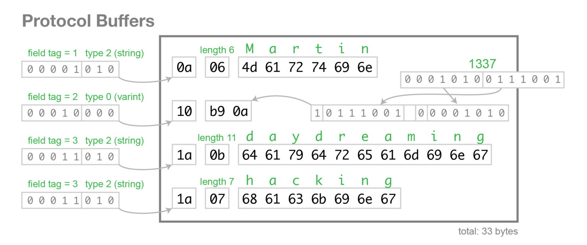
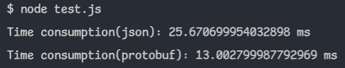

# Protocol Buffer 是什麼
## Protocol Buffer (protobuf) 是一套 Google 提出的結構化資料包裝技術，讓資料便於網路傳輸，它在設計上更易於用來包裝二進位資料

<br/>

## **優點**
## 1. 在資料包裝上更為節省空間 
## 2. 在包裝或解析上更有效率
## 3. 只需要定義一次資料結構，就能在多個語言上使用(ex: JavaScript, Golang, Python...)

## `Use Case`: 串流應用

<br/>

## 在需要傳輸二進位資料的情境下，若用JSON處理，必須先將資料轉換成 base64 的格式，再以字串的形式儲存，而這等於是二次包裝資料，導致處理上非常沒有效率。

## 與 Google Protocol Buffer 類似的技術還有 MessagePack 及 Facebook 採用的 Apache Thrift

---

# 傳遞的資料格式



---

# Demo
## .proto
```proto
syntax = "proto3";

message User {  
    message Post { 
        string id = 1;
        string title = 2;
        string content = 3;
    }

    string name = 1;
    int32 points = 2;
    repeated string labels = 3;
    repeated Post posts = 4;
    repeated User friends = 5;
}
```

## test script
```js
import { PerformanceObserver, performance } from "perf_hooks";
import pbjs from "protobufjs";
import { promisify } from "util";
import axios from "axios";

const observer = new PerformanceObserver((items) => {
  items.getEntries().forEach((item) => {
    console.log(`${item.name}: ${item.duration} ms`);
  });
});
observer.observe({ entryTypes: ["measure"], buffered: true });

const PbLoad = promisify(pbjs.load);

(async () => {
  const root = await PbLoad("user.proto");
  const User = root.lookup("User");
  const data = {
    name: "Martin",
    points: 1337,
    labels: ["daydreaming", "hacking"],
    posts: [{ id: "ezxzr", title: "hello", content: "world" }],
    friends: [
      {
        name: "Alex",
        points: 3000,
        labels: ["daydreaming", "hacking"],
        posts: [{ id: "ezxzr", title: "hello", content: "world" }],
      },
      {
        name: "Alex",
        points: 3000,
        labels: ["daydreaming", "hacking"],
        posts: [{ id: "ezxzr", title: "hello", content: "world" }],
        friends: [
          {
            name: "Alex",
            points: 3000,
            labels: ["daydreaming", "hacking"],
            posts: [{ id: "ezxzr", title: "hello", content: "world" }],
          },
          {
            name: "Alex",
            points: 3000,
            labels: ["daydreaming", "hacking"],
            posts: [{ id: "ezxzr", title: "hello", content: "world" }],
            friends: [
              {
                name: "Alex",
                points: 3000,
                labels: ["daydreaming", "hacking"],
                posts: [{ id: "ezxzr", title: "hello", content: "world" }],
              },
              {
                name: "Alex",
                points: 3000,
                labels: ["daydreaming", "hacking"],
                posts: [{ id: "ezxzr", title: "hello", content: "world" }],
              },
            ],
          },
        ],
      },
    ],
  };

  performance.mark("Start1");
  await axios.post("http://localhost:4000/ping", data);
  performance.mark("End1");
  performance.measure("Time consumption(json)", "Start1", "End1");

  performance.mark("Start2");
  const msgBuffer = User.encode(data).finish();
  await axios.post("http://localhost:4000/ping2", msgBuffer,{headers: {'Content-Type': 'application/octet-stream'}});
  performance.mark("End2");
  performance.measure("Time consumption(protobuf)", "Start2", "End2");
  
})();
```

## server
```js
import express from "express";
import pbjs from "protobufjs";
import { promisify } from "util";

const PbLoad = promisify(pbjs.load);

const server = express();

const PORT = 4000;
server
  .use(
    express.json(),
    express.urlencoded({ extended: true }),
    express.text(),
    express.raw()
  )
  .post("/ping", async (req, res) => {
    console.log("json content-length: ", req.headers["content-length"]);
    res.send("pong");
  })
  .post("/ping2", async (req, res) => {
    const root = await PbLoad("user.proto");
    const User = root.lookup("User");
    const user = User.decode(req.body);
    console.log("protobuf content-length: ", req.headers["content-length"]);
    res.send("pong");
  })
  .listen(PORT, () => console.log(`Server ready at http://localhost:${PORT}`));
```



---

# Reference
- ## [比起 JSON 更方便、更快速、更簡短的 Protobuf 格式](https://yami.io/protobuf)
- ## [Protocol Buffer Documents](https://developers.google.com/protocol-buffers/docs/proto3?hl=en)
