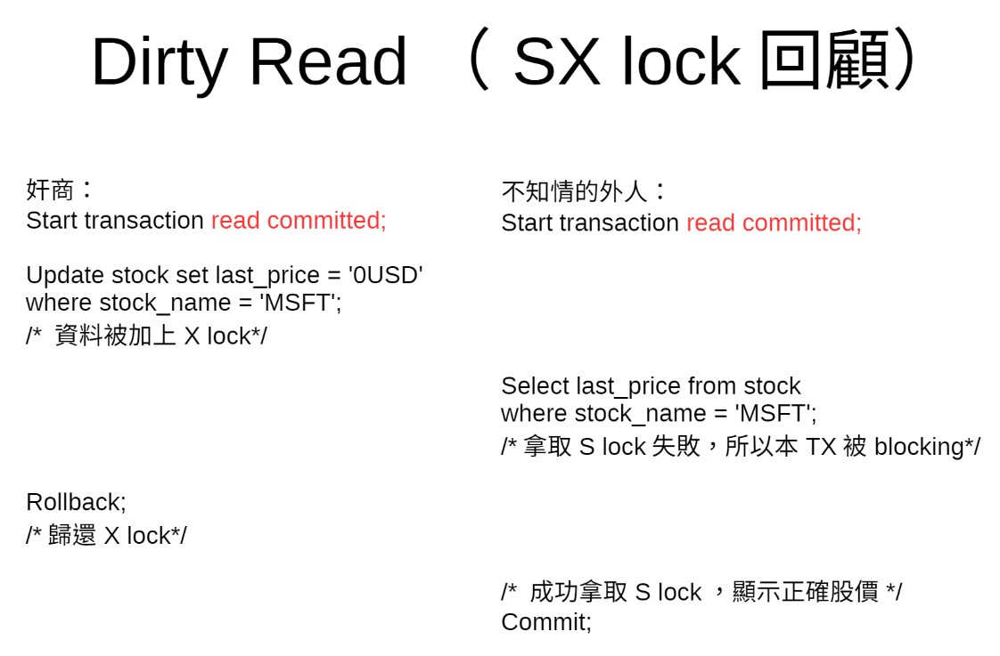

# The Meaning of ACID
## 1. Atomicity
> ### The ability to abort a transaction on error and have all writes from that transaction discarded.

## 2. Consistency
> ### You have certain statements about your data (invariants) that must always be true. For example, in an accounting system, credits and debits across all accounts must always be balanced. It's the application's responsibility to define its transactions correctly so that they preserve consistency.

## 3. Isolation
### **A mechanism to prevent race condition.**
> ### Concurrently executing transactions are isolated from each other: they cannot step on each other's toes. The database ensures that when the transactions have committed, the result is the same as if they had run serially (one after another), even though in reality they may have run concurrently.

## 4. Durability
> ### The promise that once a transaction has committed successfully, any data it has written will not be forgotten, even if there is a hardware fault or the database crashes. Perfect durability does not exist: if all your hard disks and all your backups are destroyed at the same time, there's obviously nothing your database can do to save you.

# Read Phenomena of RDBMS
## 1. Dirty Read (Read Uncommitted)
> ### It happens when a transaction reads data written by other concurrent transaction that has not been committed yet. This is terribly bad, because we don’t know if that other transaction will eventually be committed or rolled back. So we might end up using incorrect data in case rollback occurs.

<br/>


## 2. Non-repeatable Read

> ### When a transaction reads the same record twice and see different values, because the row has been modified by other transaction that was committed after the first read.

<br/>


## 3. Phantom Read

> ### The same query is re-executed, but a different set of rows is returned, due to some changes made by other recently-committed transactions, such as inserting new rows or deleting existing rows which happen to satisfy the search condition of current transaction’s query.

<br/>


---

# Strategies to Acheive Isolation

## 1. SX Lock

## ex: MySQL, MSSQL

## 2. MVCC (Multi-version Concurrency Control)
## ex: Oracle Database, PostgreSQL

<br/>


---

# Isolation Levels

## 1. Read Committed

<br/>



## 2. Repeatable Read

<br/>


## 3. Serializable

<br/>


---

# SQL

## SQL LIKE Examples

|LIKE Operator|Description|
|---------|----------|
|WHERE CustomerName LIKE 'a%'	|Finds any values that start with "a"|
|WHERE CustomerName LIKE '%a'	|Finds any values that end with "a"|
|WHERE CustomerName LIKE '%or%'|	Finds any values that have "or" in any position|
|WHERE CustomerName LIKE '_r%'|	Finds any values that have "r" in the second position|
|WHERE CustomerName LIKE 'a_%'|	Finds any values that start with "a" and are at least 2 characters in length|
|WHERE CustomerName LIKE 'a__%'|	Finds any values that start with "a" and are at least 3 characters in length|
|WHERE ContactName LIKE 'a%o'	|Finds any values that start with "a" and ends with "o"|

## Different Types of SQL JOINs


---

# Database Normalization
## **1NF**：
- ## 資料表中的所有記錄之屬性內含值都是基元值
## 未符合1NF的缺點：欄位的長度無法確定，因此必須要預留很大的空間，造成空間浪費。

## **2NF**
- ## 符合1NF
- ## 每一非鍵屬性(如：姓名、性別…)必須「完全相依」於主鍵(學號)，即不可「部分功能相依」於主鍵

## 未符合2NF的缺點：資料表中產生許多重複的資料。除了浪費儲存的空間，更容易造成新增、修改及刪除資料時的異常狀況。

## **3NF**
- ## 符合2NF
- ## 各欄位與「主鍵」之間沒有「遞移相依」的關係

---

# MySQL

```sql
-- Return "YES" if the condition is TRUE, or "NO" if the condition is FALSE:
SELECT IF(500 < 1000, "YES", "NO");
```
---

# Reference

- ## [RDBMS Tutorial](https://github.com/TritonHo/slides/blob/master/Taipei%202019-04%20course/lesson1.pdf)
- ## [Database Normalization](https://hackmd.io/@TSMI_E7ORNeP8YBbWm-lFA/rykcj8kmM)
