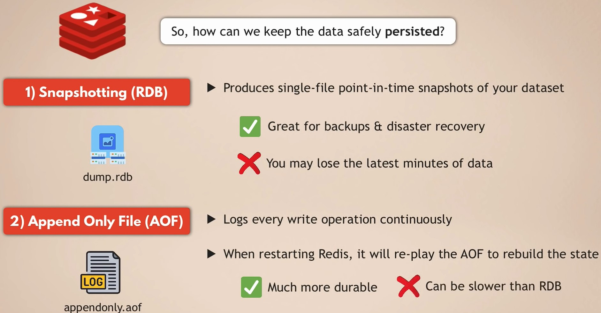
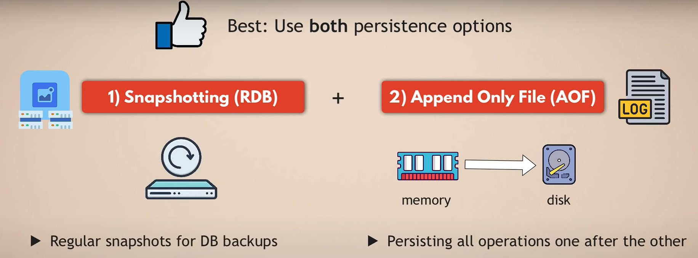
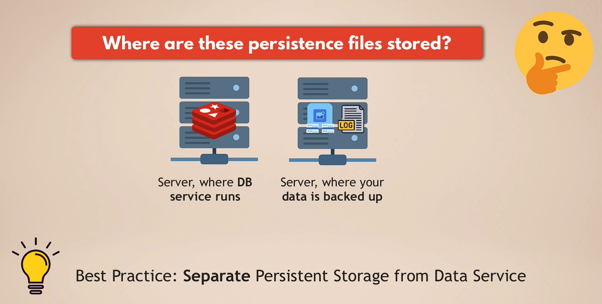
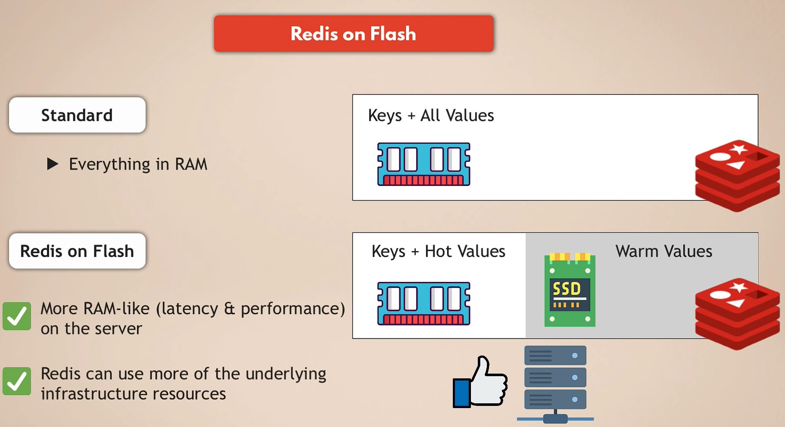
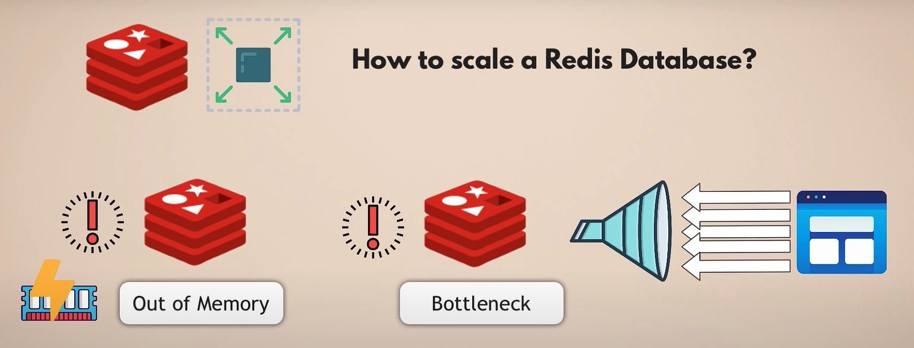
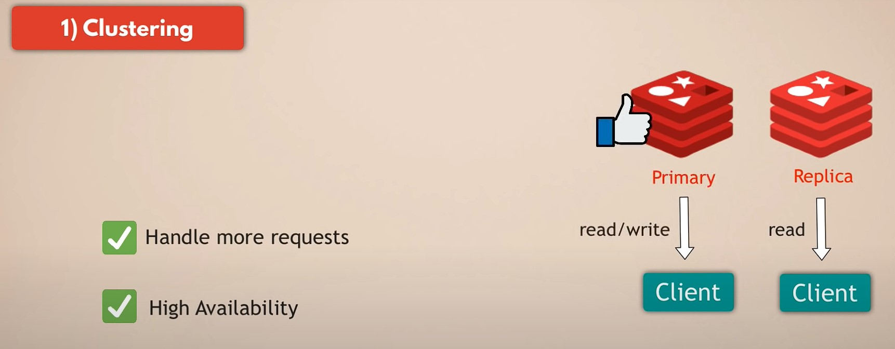
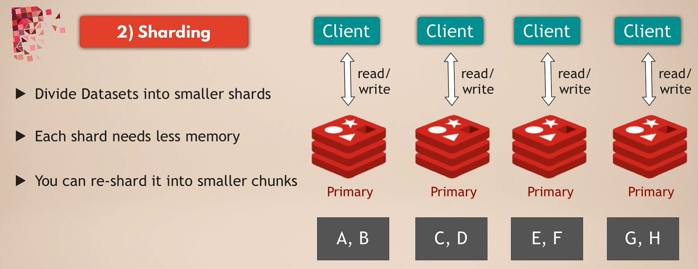

# Cheat Sheet

## redis-cli
```
redis-server

keys *
flushall

set name jojo
setex name 10 jojo
get name
ttl name
expire name
del name

lpush fruits apple
lrange fruits <start> <stop>
rpush fruits banana
rrange fruits <start> <stop>
lpop fruits
rpop fruits

sadd hobbies "running"
smembers hobbies
scard hobbies
srem hobbies "running"

hset person name jojo
hget person name
hgetall person
```

---

# Data Persistence & Durability





---

# Scaling




---

# Reference
- ## [Redis的持久化機制：RDB和AOF](https://www.gushiciku.cn/pl/pmbW/zh-tw)
- ## [Redis高可用篇：Cluster集群能支持的數據量有多大？](https://my.oschina.net/magebyte/blog/5266935)
