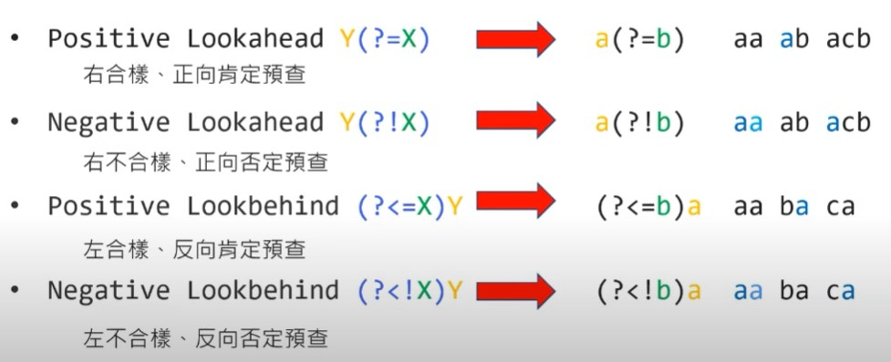
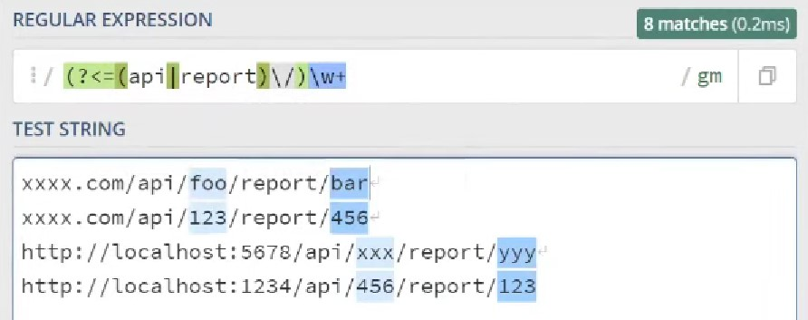
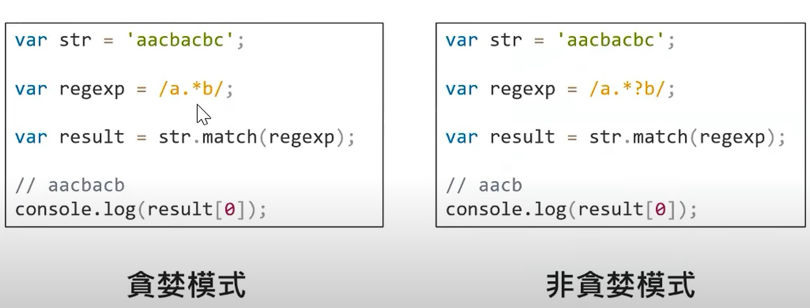

# Backreferences

```js
const str = "abc=abc,def=def,abc=def,def=abc";
const result = str.match(/(abc|def)=\1/g);
console.log(result); // ["abc=abc", "def=def"]
```

---

# Lookaround




<br />

## Use case: 驗證密碼複雜度

- 至少有一個數字
- 至少有一個小寫英文字母
- 至少有一個大寫英文字母
- 字串長度在 6 ~ 30 個字母之間

```js
const password = "abc123";
const passwordRegex = /^(?=.*\d)(?=.*[a-z])(?=.*[A-Z]).{6,30}$/;
if(passwordRegex.test(password))
    // ...
```

---

# Greedy Mode


