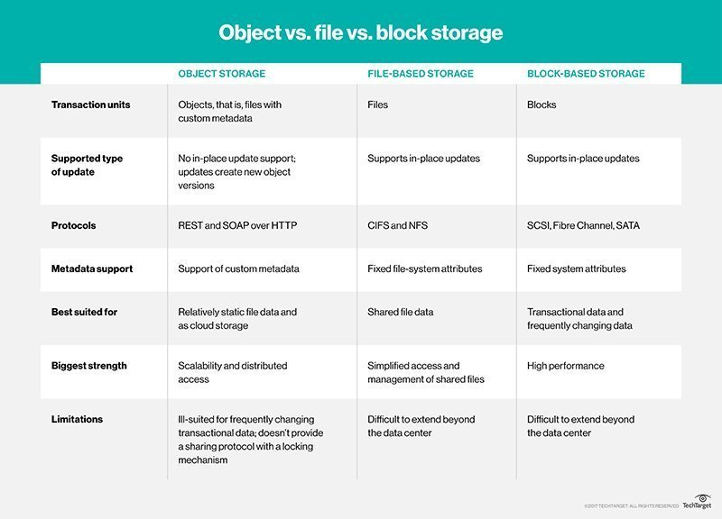

# Different Types of Storage

## **Block Storage**
> ##  Data is saved to the storage media in fixed-sized chunks called blocks. Each block is associated with a unique address, and the address is the only metadata assigned to each block. 
> ## The relatively fast, reliable performance of block storage systems make them the preferred technology for databases. Virtual machine file systems (VMFS) like VMware also tend to use block storage because of the way data is distributed across multiple volumes.
### Use cases: 
- ### Storage of databases
- ### Storage for RAID volumes
- ### Storage of data for critical systems that impact business operations
- ### Storage of data as file systems for operating systems for virtualization software vendors

## **File Storage**
> ## Data is stored in files, the files are organized in folders, and the folders are organized under a hierarchy of directories and subdirectories.
> ## Generally speaking, **discrete amounts of structured data work well** in file storage systems.
> ## The disadvantage of file storage systems, however, is that if you plan for your data to grow, there is a certain point at which the hierarchy and permissions will become complex enough to slow the system significantly.
### Use cases: 
- ### Storage of files for an office or directory in a content repository
- ### Storage of files in a small development or data center environment that is a cost effective option for local archiving
- ### Storage of data that requires data protection and easy deployment

## **Object Storage**
> ## It provides some very interesting out-of-the-box features such as object versioning or fine-grain permissions (per object or bucket), that can make development easy and help reduce operational overheads.
### Use cases: 
- ### Unstructured data such as music, media files 
- ### Large data sets

## **Block vs. File Storage**
> ## If simplicity is the goal, file storage may win out over block-level storage. But while block storage devices tend to be more complex and expensive than file storage, they also tend to be more flexible and provide better performance.

 

> ## File storage provides a centralized, highly accessible location for files, and generally comes at a lower cost than block storage. File storage uses metadata and directories to organize files, which makes it a convenient option for an organization looking to simply store large amounts of data.

 

> ## The relatively easy deployment of file storage makes it a viable tool for data protection, and the low costs and simple organization can be helpful for local archiving. File sharing within an organization is another common use for file storage.

 

> ## The simplicity of file storage can also be its downfall. While it has a hierarchical organization to it, the more files added, the more difficult and tedious it becomes to sift through file storage. If performance is the deciding factor, object or block-level storage win out over file storage.

## **Block vs. Object Storage**
> ## Rather than splitting files into raw data blocks, object storage clumps data together as one object that contains data and metadata. Blocks of storage do not contain metadata, so in that regard object storage can provide more context about the data, which can be helpful in classifying and customizing the files. Each object also has a unique identifier, which makes quicker work of locating and retrieving objects from storage.

 

> ## Block storage can be expanded, but object storage is unmatched when it comes to scalability. Scaling out an object storage architecture only requires adding nodes to the storage cluster.

 

> ## The flexibility and scalability of object storage may be appealing, but some organizations may choose to prioritize performance and choose file or block storage. While block storage allows for editing incremental parts of a file, object stores must be edited as one unit. If one part of an object needs to be edited, the entire object must be accessed and updated, then rewritten, which can negatively affect performance.

 

> ## Both object and block-level storage are used in the enterprise, but object storage use cases lean more toward scenarios dealing with large amounts of data, such as big data storage and backup archives. Because of this, modern data storage environments such as the cloud are arguably trending toward object-based storage over file and block storage options.

---

# Making a Choice Between Different Types of Cloud Storage

## So which cloud storage system is right for you? Block or file storage could be useful if you’re dealing with a lot of data that members of a team have to change frequently. You might find that block storage works best for you if you need to store an organized collection of data that you can access quickly. File storage has the advantage that the data is easy to manipulate directly without a custom-built interface. But if you need highly scalable storage units for relatively unstructured data, that is where object storage shines. Whatever path you decide, now you have a sense of the use cases, advantages, and disadvantages of different storage types to weigh your next step into the cloud storage ecosystem.

