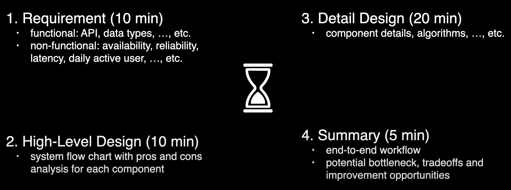
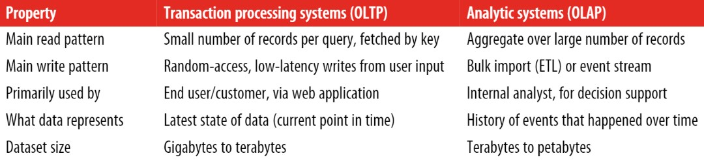
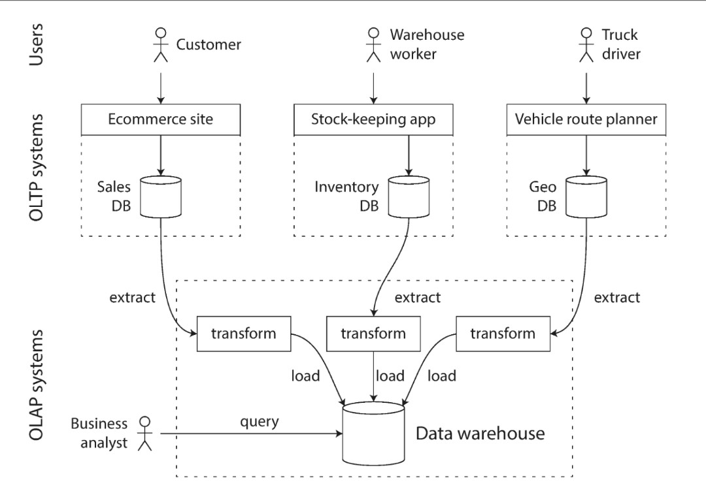
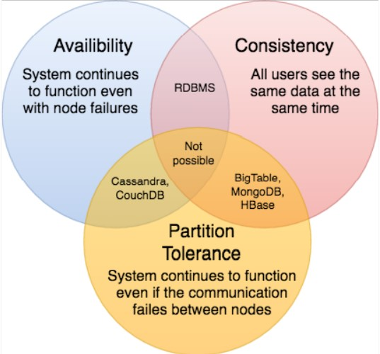

# System Design Interviews: A step by step guide

## **Step 1: Requirements clarifications**
## we should clarify what parts of the system we will be focusing on

 

## **Step 2: System interface definition**
## Define what APIs are expected from the system. This will not only establish the exact contract expected from the system, but will also ensure if we haven’t gotten any requirements wrong

 

## **Step 3: Back-of-the-envelope estimation**
## It is always a good idea to estimate the scale of the system we’re going to design. This will also help later when we will be focusing on scaling, partitioning, load balancing and caching

 

## **Step 4: Defining data model**
## Defining the data model early will clarify how data will flow among different components of the system

 

## **Step 5: High-level design**
## Draw a block diagram with 5-6 boxes representing the core components of our system. We should identify enough components that are needed to solve the actual problem from end-to-end

 

## **Step 6: Detailed design**
## Dig deeper into two or three components; interviewer’s feedback should always guide us what parts of the system need further discussion. We should be able to present different approaches, their pros and cons, and explain why we will prefer one approach on the other

 

## **Step 7: Identifying and resolving bottlenecks**
## Try to discuss as many bottlenecks as possible and different approaches to mitigate them
- ## Is there any single point of failure in our system? What are we doing to mitigate it?
- ## Do we have enough replicas of the data so that if we lose a few servers we can still serve our users? 
- ## Similarly, do we have enough copies of different services running such that a few failures will not cause total system shutdown?
- ## How are we monitoring the performance of our service? Do we get alerts whenever critical components fail or their performance degrades?

>> ## **A system that is designed to handle 100,000 requests per second, each 1 KB in size, looks very different from a system that is designed for 3 requests per minute, each 2 GB in size, even though the two systems have the same data throughput**

---

# Key Characteristics of Distributed Systems
## Scalability
- ### Ability of a system to grow and manage increased traffic
- ### Increased volume of data or requests

## Reliability
- ### Probability a system will fail during a period of time

## Availability
- ### Amount of time a system is operational during a period of time
- ### **High availability** indicates a system designed for durability, redundancy, and automatic failover such that the applications supported by the system can operate continuously and without downtime for a long period of time

## Manageability
- ### Speed and difficulty involved with maintaining system
- ### How hard to track bugs
- ### Want to abstract away from infrastructure so product engineers don't have to worry about it

---

# OLTP vs. OLAP

---

# Key Properties of OLAP Scenario

## 1. The vast majority of requests are for read access

## 2. Data is updated in fairly large batches (> 1000 rows), not by single row; or it is not updated at all

## 3. For reads, quite a large number of rows are extracted from the DB, but only a small subset of columns

## 4. Tables are “wide,” meaning they contain a large number of columns

## 5. Queries are relatively rare (usually hundreds of queries per server or less per second)

## 6. For simple queries, latencies around 50 ms are allowed

## 7. Column values are fairly small: numbers and short strings (for example, 60 bytes per URL)

## 8. Requires high throughput when processing a single query (up to billions of rows per second per server)

## 9. Transactions are not necessary

## 10. Low requirements for data consistency

## 11. A query result is significantly smaller than the source data. In other words, data is filtered or aggregated, so the result fits in a single server’s RAM

> ## Column-oriented databases are better suited to OLAP scenarios

---

# SQL vs. NoSQL
- ## If your application has mostly one-to-many relationships or no relationships between records, the document model is appropriate

- ## The relational model can handle simple cases of many-to-many relationships, but as the connections within your data become more complex, it becomes more natural to start modeling your data as a graph
## SQL
- ### MySQL
- ### Oracle
- ### MS SQL Server
- ### PostgreSQL
- ### MariaDB

 

## NoSQL
### **Key-Value Stores**
- ### Redis
- ### Voldemort
- ### Dynamo

### **Document Databases**
- ### MongoDB
- ### CouchDB

### **Wide-Column Databases**: best suited for analyzing large datasets
- ### Cassandra
- ### HBase

### **Graph Databases**:  used to store data whose relations are best represented in a graph
- ### Neo4J
- ### InfiniteGraph

 

## **Reasons to use SQL database**
### 1. Need to ensure ACID compliance
### 2. Data is structured and unchanging

 

## **Reasons to use NoSQL database**
### **Note: Generally, NoSQL databases sacrifice ACID compliance for scalability and processing speed**
### 1. Storing large volumes of data that often have little to no structure
### 2. Making the most of cloud computing and storage
### 3. Rapid development

---

# CAP Theorem

## **We can only build a system that has any two of these three properties**

 

## To be consistent, all nodes should see the same set of updates in the same order. But if the network suffers a partition, updates in one partition might not make it to the other partitions before a client reads from the out-of-date partition after having read from the up-to-date one. The only thing that can be done to cope with this possibility is to stop serving requests from the out-of-date partition, but then the service is no longer 100% available.

---

# Reference
- ## [億級流量系統架構演進之路](https://my.oschina.net/upyun/blog/5267838)
- ## [CAP定理101—分散式系統](https://medium.com/%E5%BE%8C%E7%AB%AF%E6%96%B0%E6%89%8B%E6%9D%91/cap%E5%AE%9A%E7%90%86101-3fdd10e0b9a)
