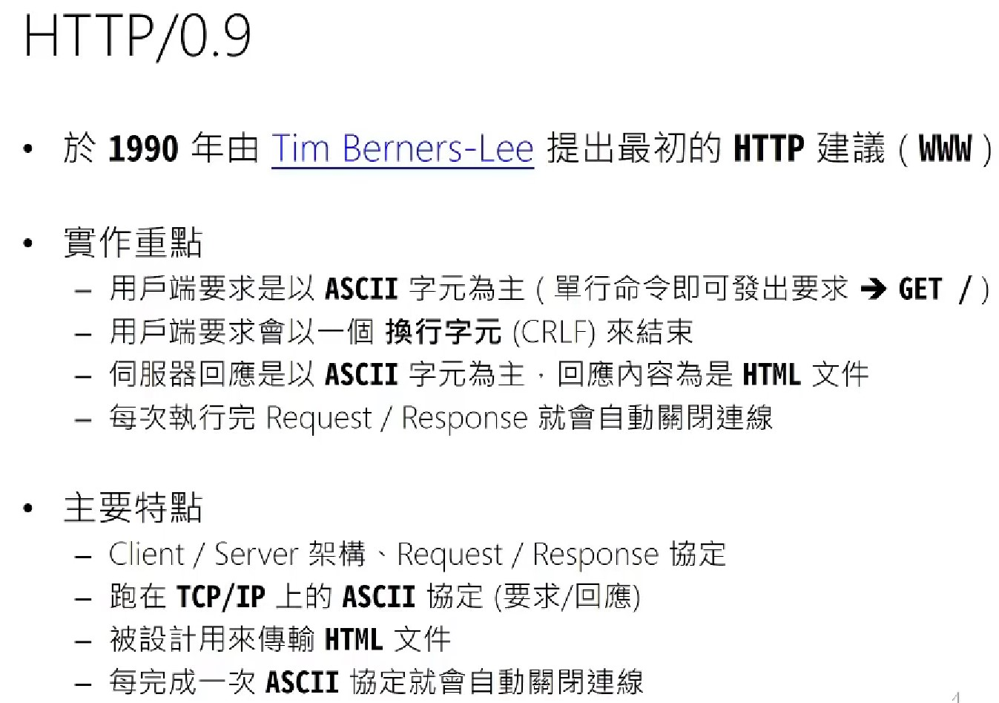
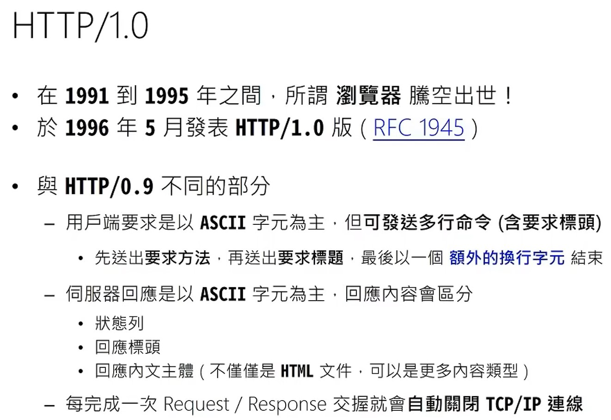
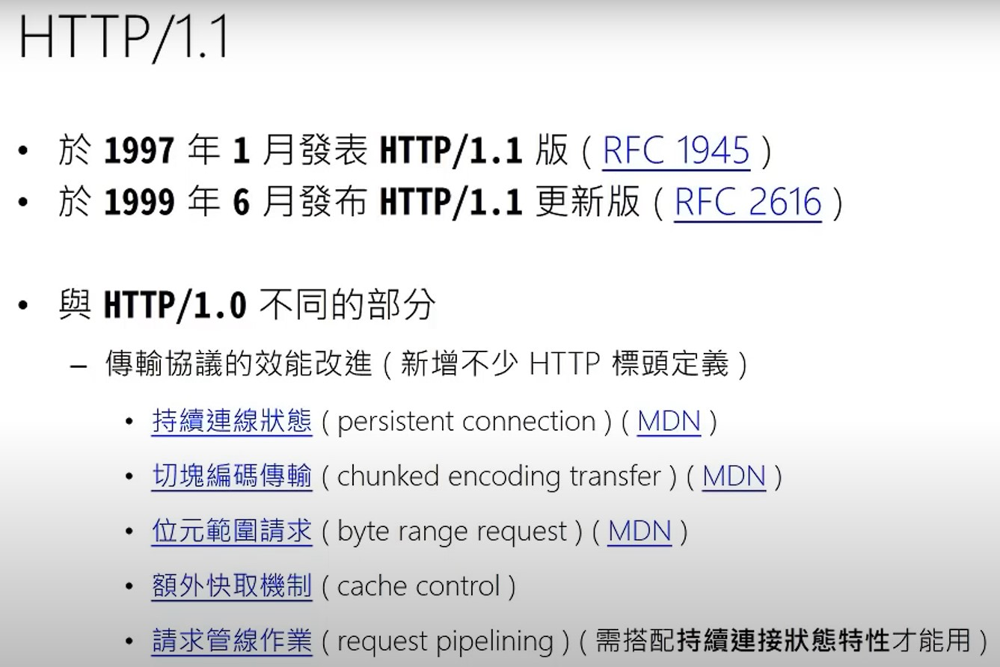
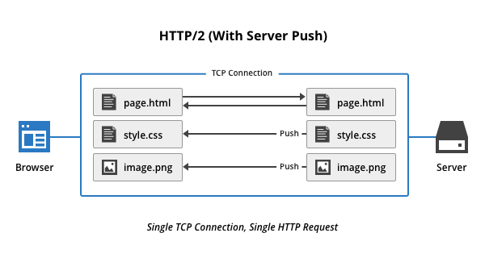
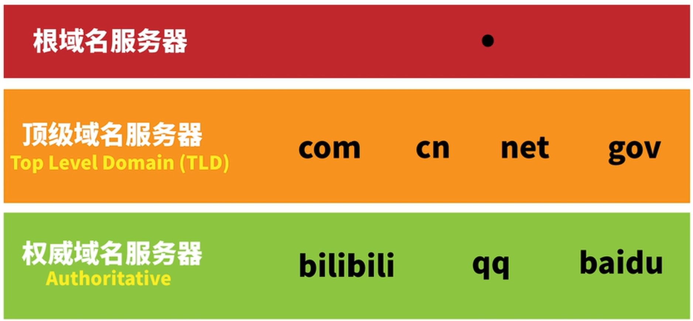
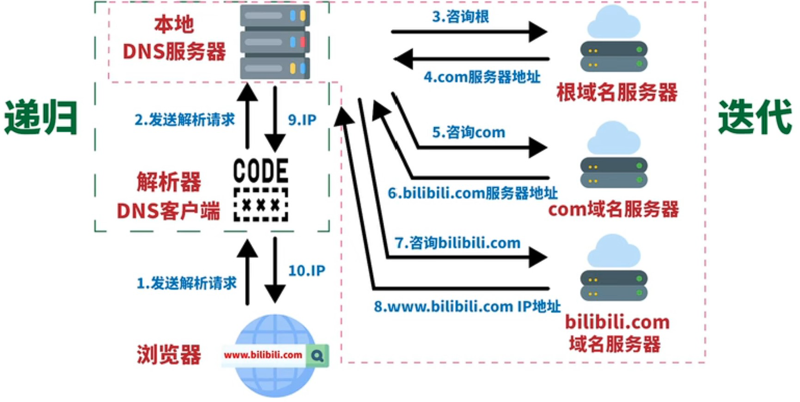

# What You Should Know About HTTP 

---

# HTTP/2

## **Multiplexing**
## Multiplexing will allow multiple requests and response messages to retrieve resources in a single TCP connection simultaneously.

## **Header Compression**
## Each request via HTTP contains header information. With HTTP/1.1, many headers are repeated in one session and duplicate the same info. This overhead is considerable, HTTP/2 removes the excess header while pressing the remaining headers and forcing all HTTP headers to be sent in a compressed format.

## **Server Push**
## With HTTP/1.1 it must wait for the client to send the connection. Server Push allows the server to avoid delays in sending data by “pushing” responses that it claims the client needs to cache it and automatically this will speed up page load time by reducing the number of requests.

## **Binary Format**
## HTTP/1.1 sends data in the textual format, while HTTP/2 sends data in binary format. Binary protocols are more efficient to parse and reduce the number of errors, compared to previous versions of textual protocols.

---

# DNS域名解析過程

---

# Reference
- ## [DNS域名解析過程](https://www.bilibili.com/video/BV1uL4y1B7aE?spm_id_from=333.999.0.0)
- ## [Root Zone Management](https://www.iana.org/domains/root/servers)
- ## [VPN概念、技術原理及誤區](https://www.bilibili.com/video/BV1KY411t75D?spm_id_from=333.999.0.0)