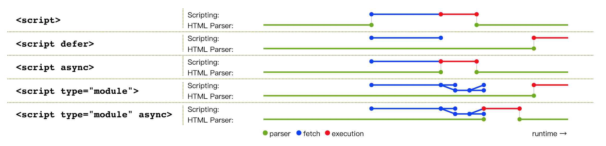

# 性能優化的9大策略

## 網路層面：如何讓資源體積更小、加載更快
## 1. **建構策略**：基於構建工具( Webpack/Rollup/Parcel/Esbuild/Vite/Gulp)

 

## 2. **圖片策略**：基於圖片類型( JPG/PNG/SVG/WebP/Base64)
- ## 圖片選型：了解所有圖片類型的特點及其何種應用場景最合適
- ## 圖片壓縮：在部署到生產環境前使用工具或腳本對其壓縮處理
<table><thead><tr><th align="center">類型</th><th align="center">體積</th><th align="center">質量</th><th align="center">兼容</th><th align="center">請求</th><th align="center">壓縮</th><th align="center">透明</th><th>場景</th></tr></thead><tbody><tr><td align="center">JPG</td><td align="center">小</td><td align="center">中</td><td align="center">高</td><td align="center">是</td><td align="center">有損</td><td align="center">不支持</td><td>背景圖、輪播圖、色彩豐富圖</td></tr><tr><td align="center">PNG</td><td align="center">大</td><td align="center">高</td><td align="center">高</td><td align="center">是</td><td align="center">無損</td><td align="center">支持</td><td>圖標、透明圖</td></tr><tr><td align="center">SVG</td><td align="center">小</td><td align="center">高</td><td align="center">高</td><td align="center">是</td><td align="center">無損</td><td align="center">支持</td><td>圖標、矢量圖</td></tr><tr><td align="center">WebP</td><td align="center">小</td><td align="center">中</td><td align="center">低</td><td align="center">是</td><td align="center">兼備</td><td align="center">支持</td><td>看兼容情況</td></tr><tr><td align="center">Base64</td><td align="center">看情況</td><td align="center">中</td><td align="center">高</td><td align="center">否</td><td align="center">無損</td><td align="center">支持</td><td>圖標</td></tr></tbody></table>

 

<table><thead><tr><th align="center">工具</th><th align="center">開源</th><th align="center">收費</th><th align="center">API</th><th>免費體驗</th></tr></thead><tbody><tr><td align="center"><a href="https://link.juejin.cn?target=https%3A%2F%2Fwww.tuhaokuai.com" target="_blank" rel="nofollow noopener noreferrer" title="https://www.tuhaokuai.com" ref="nofollow noopener noreferrer">QuickPicture</a></td><td align="center">✖️</td><td align="center">✔️</td><td align="center">✖️</td><td>可壓縮類型較多，壓縮質感較好，有體積限制，有數量限制</td></tr><tr><td align="center"><a href="https://link.juejin.cn?target=https%3A%2F%2Fshrinkme.app" target="_blank" rel="nofollow noopener noreferrer" title="https://shrinkme.app" ref="nofollow noopener noreferrer">ShrinkMe</a></td><td align="center">✖️</td><td align="center">✖️</td><td align="center">✖️</td><td>可壓縮類型較多，壓縮質感一般，無數量限制，有體積限制</td></tr><tr><td align="center"><a href="https://link.juejin.cn?target=https%3A%2F%2Fsquoosh.app" target="_blank" rel="nofollow noopener noreferrer" title="https://squoosh.app" ref="nofollow noopener noreferrer">Squoosh</a></td><td align="center">✔️</td><td align="center">✖️</td><td align="center">✔️</td><td>可壓縮類型較少，壓縮質感一般，無數量限制，有體積限制</td></tr><tr><td align="center"><a href="https://link.juejin.cn?target=https%3A%2F%2Ftinyjpg.com" target="_blank" rel="nofollow noopener noreferrer" title="https://tinyjpg.com" ref="nofollow noopener noreferrer">TinyJpg</a></td><td align="center">✖️</td><td align="center">✔️</td><td align="center">✔️</td><td>可壓縮類型較少，壓縮質感很好，有數量限制，有體積限制</td></tr><tr><td align="center"><a href="https://link.juejin.cn?target=https%3A%2F%2Ftinypng.com" target="_blank" rel="nofollow noopener noreferrer" title="https://tinypng.com" ref="nofollow noopener noreferrer">TinyPng</a></td><td align="center">✖️</td><td align="center">✔️</td><td align="center">✔️</td><td>可壓縮類型較少，壓縮質感很好，有數量限制，有體積限制</td></tr><tr><td align="center"><a href="https://link.juejin.cn?target=https%3A%2F%2Fzhitu.isux.us" target="_blank" rel="nofollow noopener noreferrer" title="https://zhitu.isux.us" ref="nofollow noopener noreferrer">Zhitu</a></td><td align="center">✖️</td><td align="center">✖️</td><td align="center">✖️</td><td>可壓縮類型一般，壓縮質感一般，有數量限制，有體積限制</td></tr></tbody></table>

 

## 3. **分發策略**：基於內容分發網絡(CDN)
## 遵循以下兩點就能發揮CDN最大作用。

- ## 所有靜態資源走CDN：開發階段確定哪些文件屬於靜態資源
- ## 把靜態資源與主頁面置於不同域名下：避免請求帶上Cookie

 

## 4. [**緩存策略**](https://github.com/evanhongo/technical-sharing/blob/master/%E7%80%8F%E8%A6%BD%E5%99%A8%E7%9B%B8%E9%97%9C%E7%9F%A5%E8%AD%98.md)：基於瀏覽器緩存(强缓存/協商缓存)

 

## 渲染層面：如何讓代碼解析更好、執行更快
## 5. **CSS策略**：基於CSS規則
- ## 避免出現超過三層的嵌套規則
- ## 避免為ID選擇器添加多餘選擇器
- ## 避免使用標籤選擇器代替類選擇器
- ## 避免使用通配選擇器，只對目標節點聲明規則
- ## 避免重複匹配重複定義，關注可繼承屬性

 

## 6. **DOM策略**：基於DOM操作
- ## 緩存DOM計算屬性
- ## 避免過多DOM操作
- ## 使用DOMFragment緩存批量化DOM操作

 

## 7. **阻塞策略**：基於腳本加載

## Async 
## `Use Case: 非 UI 庫`

 

## 8. **回流重繪策略**：基於回流重繪
- ## 緩存DOM計算屬性
- ## 使用類合併樣式，避免逐條改變樣式
- ## 盡量使用 visibility:hidden 代替 display:none
- ## 使用 transform:translate3d 代替 top
- ## 適當使用 will-change 屬性

 

## 9. **異步更新策略**：基於異步更新
- ## [在異步任務中修改DOM時，把其包裝成微任務](http://static.kancloud.cn/sllyli/performance/1242203)
  
---

# Debounce & Throttle
## debounce: 從最後一次觸發開始，在 t 秒後執行函數。因為是最後一次觸發，所以會把中間的觸發蓋掉。
## `Use Case: 搜尋輸入框的推薦關鍵字功能`

 

## throttle: 從最初一次觸發開始，在 t 秒後執行函數。中間無論觸發多少次都不會執行。

## `Use Case: 偵測滑鼠移動 `

---

# Reference
- ## [Demo: Debounce & Throttle](http://demo.nimius.net/debounce_throttle)
- ## [關於性能優化的9大策略和6大指標](https://juejin.cn/post/6981673766178783262)
- ## [Event Loop完整分析](https://juejin.cn/post/6893827826949029896)
- ## [渲染的時機](http://static.kancloud.cn/sllyli/performance/1242203)